# Monitor HEX

HEX 是为 monitor-probe 制作的监控主题。当前版本 **0.1.0**，主题短名 **hex**。

本版本聚焦首页搜索、移动端阅读和详情页信息层级：桌面搜索靠近主题设置，手机使用图标入口并在屏幕中央打开搜索框；详情资料按功能分组，移动端图表时间范围保持完整同组排列。验收入口见 `ACCEPTANCE.md`。

## 安装

从 [最新 Release](https://github.com/8bitNull/Monitor-Hex/releases/latest) 下载 **[theme.tar.gz](https://github.com/8bitNull/Monitor-Hex/releases/latest/download/theme.tar.gz)**。

在后台主题管理上传 `theme.tar.gz`，然后选择 **Monitor HEX**。请勿上传源码 ZIP。安装包根目录包含 theme.json、dist、preview.png 和许可证。

手动安装时解压至主题目录下的 `hex/`。由于短名已更改，后台会识别为新主题，安装后需选择启用。页面顶栏的站点主名称仍遵循后台站点设置，主题标识为 MONITOR HEX。

## 默认显示

- 手机端（宽度不超过 720px）采用单行地区选择与图标式视图切换；点击地区打开底部面板，查看国旗、地区名称和节点数。首页隐藏地图，优先展示节点。
- 桌面地图默认 169% 缩放，默认聚焦北美、欧洲和东亚，可拖动、缩放、全屏及筛选地区。
- 默认资源样式为细进度条，卡片按身份、资源、网速、延迟、辅助资料排列；已有明确保存的样式选择继续保留。
- 总览为节点、今日流量、实时网速、高负载提示四栏，手机为两列。
- 首页默认一条线路，可在主题设置中调整为最多三条；详情页查看全部线路。
- 支持深浅色、资源与网速指标、备注标签及延迟历史图表。

## 搜索与语言

桌面端搜索框位于页首主题设置左侧。手机端只显示放大镜入口，点击后在屏幕中央打开搜索框；搜索支持清除，长列表提供返回顶部操作。

手机和电脑端均可在右上角设置按钮 → **语言 / Language** 中选择 **简体中文** 或 **English**，即时生效并记住选择。

## 卡片显示自定义

在右上角设置 → **显示内容 → 卡片信息**，分别控制本月用量、TCP／UDP、在线时长、到期信息、备注和价格。仅控制首页卡片，详情页保留完整资料。

**完整**显示全部六项；**精简**隐藏 TCP／UDP 和在线时长，保留用量、到期、备注和价格。应用预设后仍可逐项修改，其他组合标记为**自定义**。手机独立方案也有自己的预设。预设不更改颜色、语言、指标样式、列数或地图；升级不会自动套用预设。

- **手机显示**默认跟随通用设置。选择“单独设置”后，仅对宽度不超过 720px 的卡片生效；第一次复制通用选项，再次开启会恢复已保存的手机方案。
- **桌面列数**位于卡片信息分组下方，可选自动、2、3、4 列。自动保持原布局；手动列数受卡片最小宽度 300px 限制，窗口较窄时自动降列。手机保持单列。
- **高级外观**默认折叠，包含背景、模糊、遮罩与玻璃效果。
- “恢复默认外观”保留卡片显示与列数选择；“重置全部偏好”重新跟随站点默认。导入导出包含新选项，旧配置仍可使用。
- 偏好保存在当前浏览器，不跨设备同步。站点默认可在 `public/theme-config.json` 中设置 `cardInfo`、`mobileInfoMode`、`mobileCardInfo`、`desktopColumns`；列数值使用字符串 `"auto"`、`"2"`、`"3"`、`"4"`。

| 完整卡片 | 精简卡片 |
| --- | --- |
| 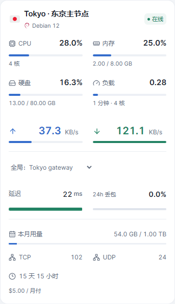 | 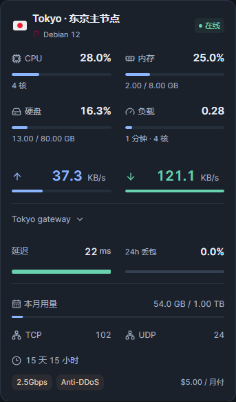 |

## 高负载记录

在主题设置中开启高负载提示。CPU 达到 85% 开始记录，低于 80% 标为恢复，避免阈值附近反复闪动。第四栏显示当前告警数量及最近事件，点击可查看开始、恢复或最后观测时间、持续时长（时:分:秒）及 CPU 峰值。

记录保存在当前站点、当前浏览器，最多保留最近 100 条结束记录，正在进行的记录保留。关闭提示不清除历史。详情页停留期间继续监测；页面关闭期间无法监测，重开后未确认结束的事件标记为监测中断，持续时长只计算已观测时段。存储不可用时会显示提示。它不是服务端全天候告警日志，不在设备间同步。

为兼容原主题，浏览器偏好与历史存储键保留原来的内部名称；安装不修改服务器数据。更改主题短名后，后台主题默认设置如有自定义，请在新主题中重新确认。

## 开发与验收

`npm install`、`npm run build`、`npm run lint`、`npm test`。`npm run demo` 启动演示数据页面；`npm run package` 生成 theme.tar.gz。浏览器测试按功能组织，运行 `npm run test:e2e` 检查当前版本的 148 项交互用例（需已安装 Chrome）；设置 `TEST_BROWSER=msedge` 可改用 Edge。测试前先执行 `npm run build`。

截图由当前生产构建配合本地演示数据生成，不代表已部署至用户线上站点。许可和参考来源见 NOTICE.md、LICENSE、LICENSE.komari-next。

## 详情页

详情页按设备资料、实时状态、历史图表阅读。桌面资料区按硬件与系统、网络与流量、费用与到期组成三列网格，实时状态独立为全宽模块，历史图表位于最下方；手机资料按三组折叠后依次展示实时状态和历史图表。PC 端不重复显示设备资料标题，CPU 保持纯文本展示，IPv4 和 IPv6 等适合复制的资料保留复制按钮。

- 资源主图可切换四项指标，手机点按数据点查看提示；图表提示支持关闭、点外部关闭和内部滚动。
- 延迟线路超过 6 条时支持名称搜索；批量显示、隐藏和恢复首页线路始终作用于完整线路集合。
- 打开线路面板时已选项优先，多选期间保持顺序；Escape 关闭面板并返回入口焦点。
- 线路使用固定颜色与有限虚实线组合，切换范围或隐藏后恢复时样式稳定，图例与曲线保持对应。
- 失败刷新保留同范围的上次成功记录，并直接展示上次成功时间；切换范围不会沿用其他范围的时间。
- 超长名称默认最多两行，可独立展开；长备注使用自然换行；复制成功提示短暂显示，失败可重试。
- 手机资源和延迟工具栏将 `1h`、`6h`、`24h`、`7d` 作为同一组排列。常规手机宽度下四项同排；极窄屏只会把整组移到下一行，不会让 `7d` 单独掉行，也不会遮挡刷新按钮。

设置 → **详情页 → 设备资料展开方式**提供自动、展开、折叠。自动模式在 900px 以下折叠、900px 及以上展开；手动展开或折叠会记住选择。可在设置中恢复自动。偏好支持导入导出，“恢复默认外观”保留该选择，“重置全部偏好”恢复站点默认。资料按硬件与系统、网络与流量、费用与到期分组。CPU、内存、硬盘组成主要读数组；负载与 TCP/UDP 作为辅助信息，离线时显示未知值。长名称展开入口在标题下方，长备注展开后使用自然换行的轻量文本。可复制的长资料与按钮分列，完整原值仍可复制。

## 本地开发与 GitHub 同步

源码仓库：https://github.com/8bitNull/Monitor-Hex

使用 Node.js 24 与 npm。首次准备开发环境：

```sh
npm ci
npm run dev
```

生产检查与打包：

```sh
npm run lint
npm test
npm run package
```

生成的 `theme.tar.gz` 用于后台安装。依赖、构建文件和安装包不提交到源码仓库；安装包通过 [GitHub Releases](https://github.com/8bitNull/Monitor-Hex/releases) 发布。

每次开发前，在工作区没有未提交修改时运行 `git pull --ff-only` 获取远端更新。修改完成后检查并上传：

```sh
git status
git diff
git add .
git commit -m "说明本次修改"
git push
```

保存文件不会自动上传；提交并推送后才会同步至 GitHub。当前版本检查说明见 `ACCEPTANCE.md`。浏览器测试和截图脚本的原始图片保存在 `tests/artifacts/`，不提交到源码仓库；用于首页展示的精选图片保存在 `screenshots/`。

## 截图

以下截图使用本地演示数据，按页面类型逐行展示当前主题界面。

| 页面 | 截图 |
| --- | --- |
| 首页仪表盘（浅色） | 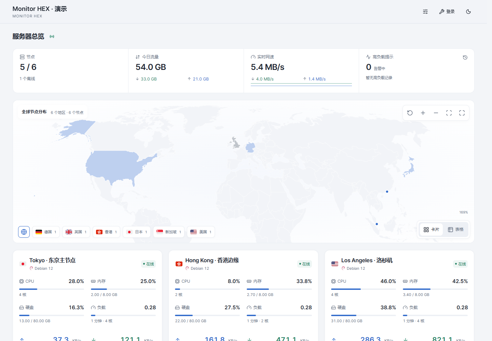 |
| 首页仪表盘（深色） | 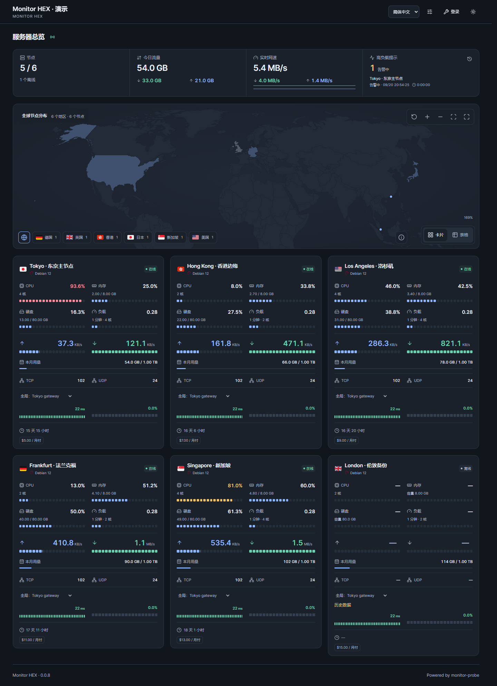 |
| 手机首页（浅色） | 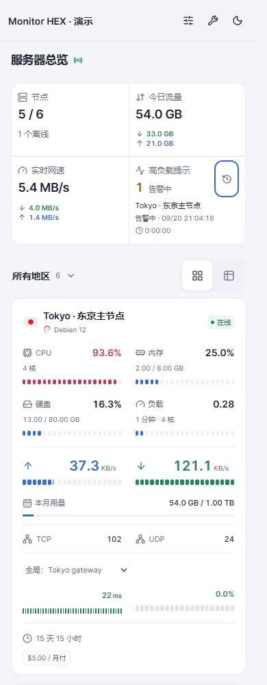 |
| 手机首页（深色） | 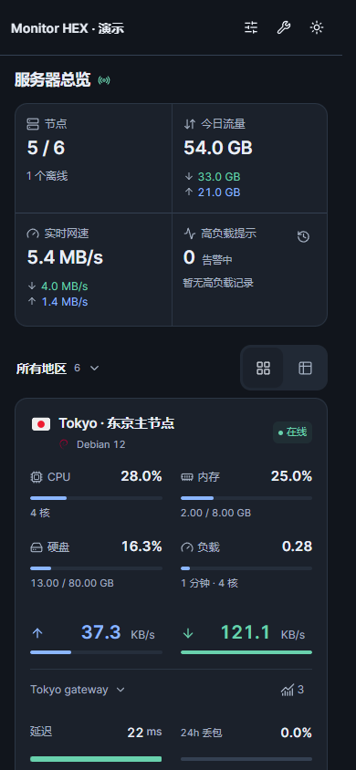 |
| 显示设置（桌面） | 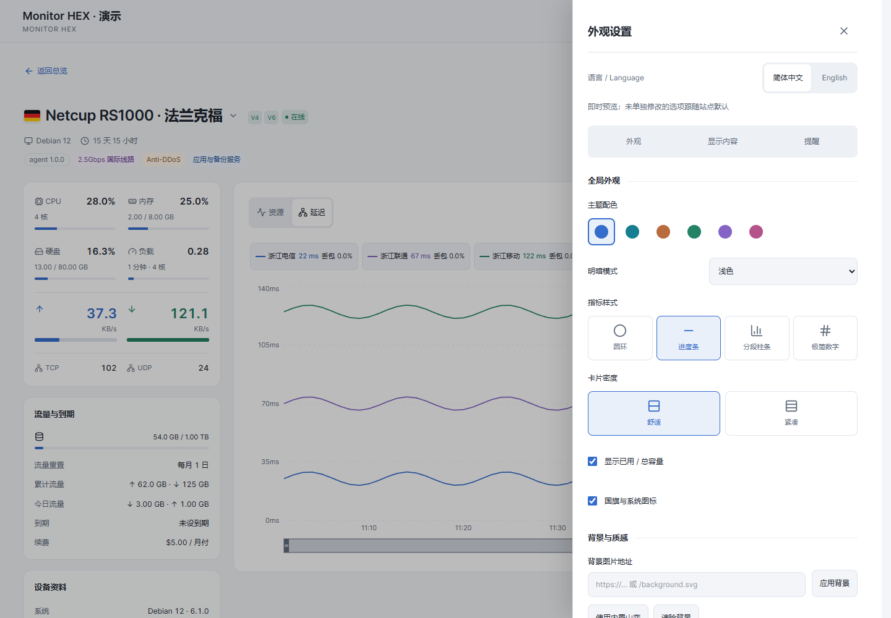 |
| 显示设置（手机） | 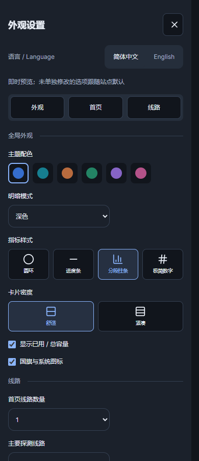 |
| 详情页资源 | 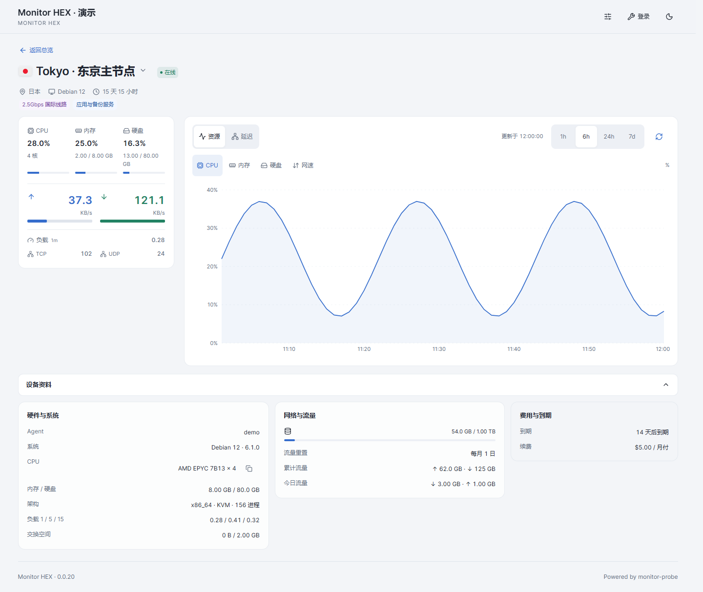 |
| 详情页延迟 | 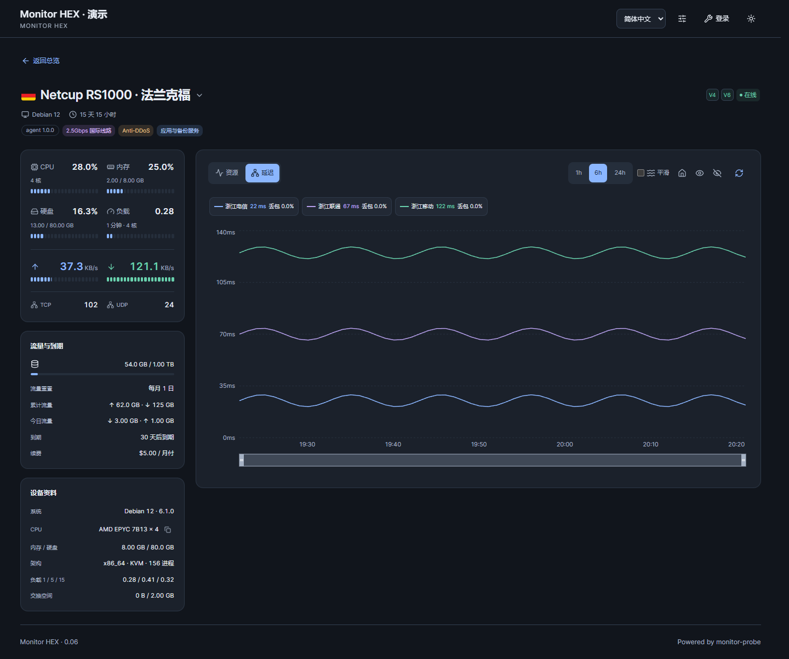 |
| 移动端详情与对比（浅色） | 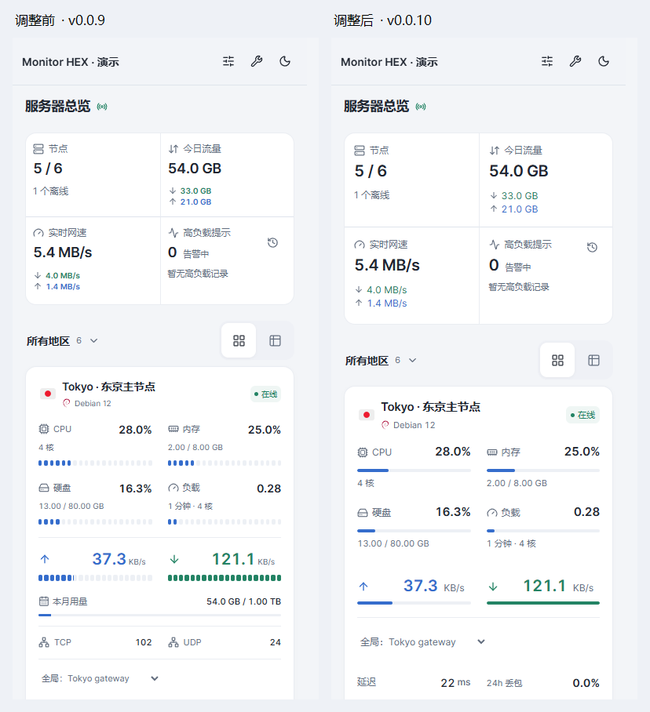 |
| 移动端详情与对比（深色） | 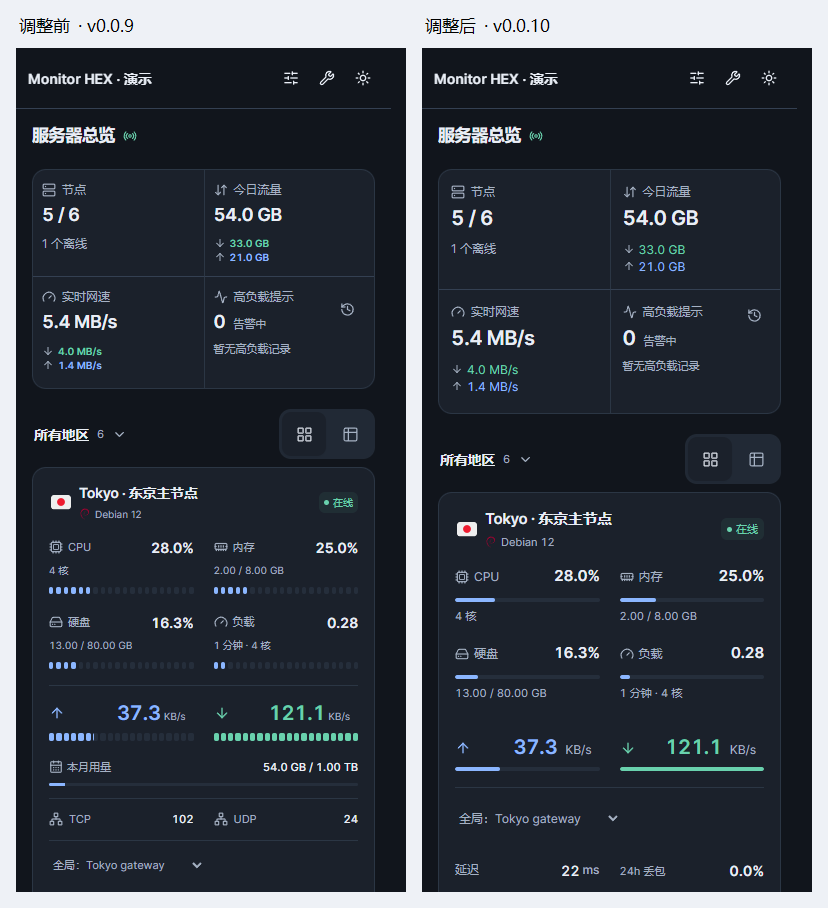 |
