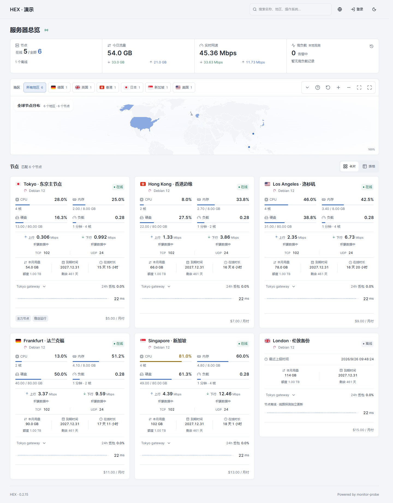
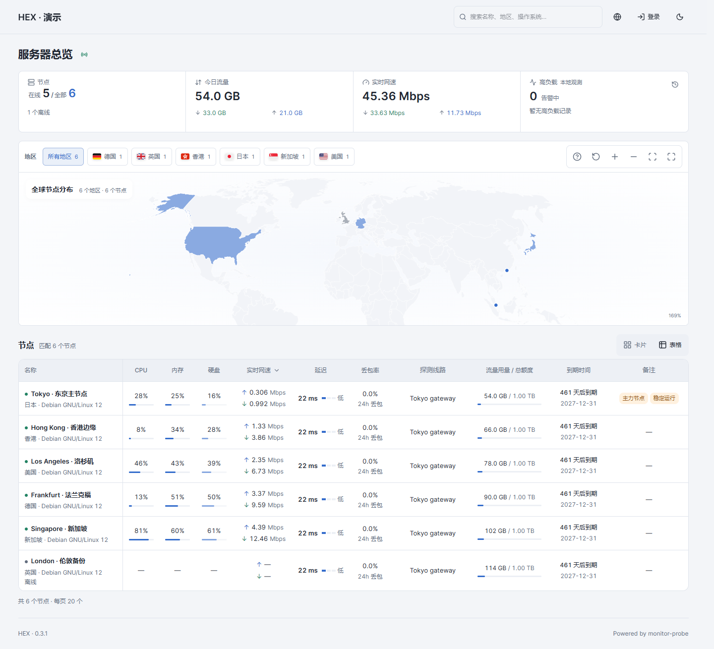
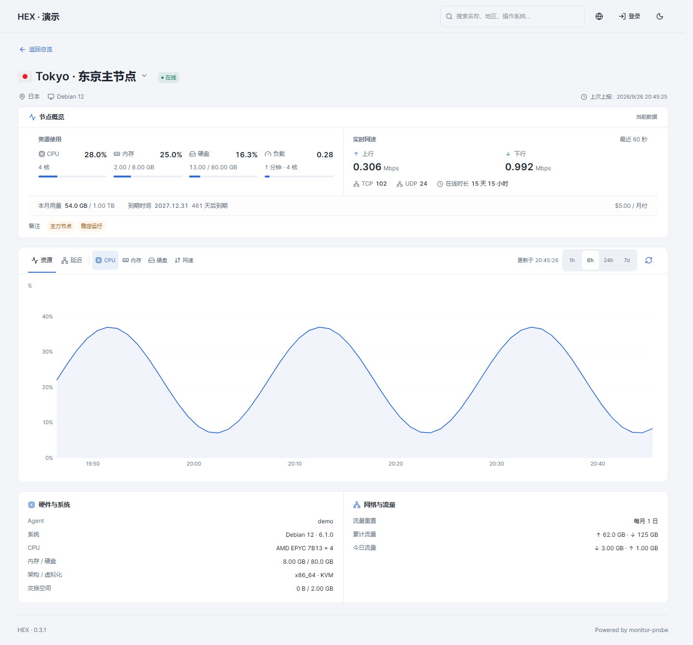
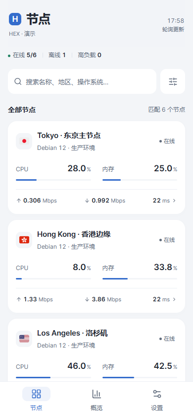

# HEX

HEX 是为 monitor-probe 制作的监控主题。你可以在首页查看服务器状态、资源占用和网络情况，也可以进入单台服务器的详情页，查看历史曲线、流量用量和设备资料。

主题在电脑端提供卡片和表格视图，手机端采用 App 式布局，支持深浅色以及简体中文和英文。

v0.3.0 手机端使用底部「节点 / 概览 / 设置」导航。节点页优先展示紧凑卡片，详情分为「总览 / 资源 / 网络 / 资料」四个分区。手机端与电脑端共用真实监控接口。

[下载安装包](https://github.com/8bitNull/monitor-theme-hex/releases/latest/download/theme.tar.gz) · [查看发布记录](https://github.com/8bitNull/monitor-theme-hex/releases)

## 页面预览

以下截图来自本地演示数据，服务器名称、备注和数值仅用于展示。



<details>
<summary>查看表格、详情页和手机效果</summary>







</details>

## 安装与升级

先准备好正在运行的 monitor-probe，然后从 [最新发布页面](https://github.com/8bitNull/monitor-theme-hex/releases/latest) 下载 `theme.tar.gz`。在后台的主题管理中上传这个文件，再选择 **HEX** 启用。

升级时上传新的安装包覆盖即可。GitHub 自动生成的源码 ZIP 不是主题安装包，不能直接用于后台安装。发布页面同时提供 `theme.tar.gz.sha256`，需要时可以用它核对下载文件。

主题短名为 `hex`。页面顶部的站点名称读取后台配置；服务器名称、备注、价格、到期时间等内容也由后台管理。

地图加载时会显示进度提示；网络较慢或加载失败时，节点列表仍可使用。维护者可参考[地图性能与部署说明](MAP-PERFORMANCE.md)检查资源压缩和缓存。

## 首页怎么用

电脑首页上方汇总全站节点数、今日流量、实时网速和高负载情况。点击在线、全部或离线数量，可以筛选下方的节点。手机端将这些统计放入独立的「概览」页；节点页保留简洁的在线、离线和高负载数量，点击即可筛选。

搜索支持服务器名称、地区和操作系统等信息。手机端搜索框直接显示在列表上方，旁边的筛选按钮打开底部面板，可组合选择状态、地区、分组与排序。

### 卡片视图

卡片适合逐台查看服务器。电脑端展示完整指标；手机默认展示名称、系统、CPU、内存、上下行和所选线路延迟。手机设置中的「详细」列表可补充流量用量、在线时长与连接数，仍遵循站点的字段配置。完整设备和账单信息在详情查看。高负载、临近到期与流量额度耗尽会直接提醒；离线节点突出最近上报时间，隐藏失效读数。点击卡片进入详情。

上下行旁的曲线反映最近一分钟收到的速率变化。刚打开页面时，需要先积累数据。首页默认展示一条探测线路；站点管理员可在后台主题设置中改为两条或三条，更多线路在详情页查看。

### 表格视图

表格适合在电脑端横向比较多台服务器，默认显示名称、CPU、内存、硬盘、实时网速、延迟、丢包率、探测线路、流量用量与额度、到期时间和备注。手机端使用专门的节点列表，原有表格偏好仍保存在浏览器中。

电脑首页不提供表格列设置入口；此前保存在当前浏览器中的列选择仍会沿用。名称与状态固定保留，备注位于末列。

每页显示 20 个节点，少于一页时不显示翻页按钮。点击支持排序的表头可切换顺序，实时网速的下拉框可以选择上下行排序，延迟和丢包率分别点击对应表头排序。筛选和排序针对全部匹配节点，再按页展示；从详情页返回时会保留当前页。

备注显示时位于最后一列，按中英文分号拆成彩色标签。表格最多展示三个标签，其余以数量提示，点击可以查看完整备注。没有备注时显示“—”。

表格随整个页面上下滚动，没有单独的纵向滚动区域。横向滚动条隐藏，但窄屏仍可滑动查看。

### 地图

电脑端默认显示地图和地区筛选栏，地图高度会记住上次选择；卡片和表格视图共用这些设置。点击地图上的地区或地区按钮，可以筛选节点。地图支持拖动、缩放和全屏，具体操作可查看地区栏右侧的帮助。

手机不显示地图，通过地区选择面板筛选。如果电脑上看不到地图，可在后台主题设置中检查“首页地图”是否开启。

## 服务器详情

详情页先展示状态、资源、实时网络、用量与账期，再展示历史图表和设备资料。离线或数据过期时会显示最近上报时间，并隐藏失效的实时资源读数；线路探测按自己的采样时间标记是否为较旧记录。设备资料包含硬件、系统及网络信息，可用的 IP 地址支持复制。

资源历史可查看 CPU、内存、硬盘和网络速率，时间范围包括 1 小时、6 小时、24 小时和 7 天。延迟历史支持 1 小时、6 小时和 24 小时，点击线路图例可以显示或隐藏曲线，拖动下方缩略图可缩小查看范围。

延迟图下方还有丢包时间轨道。显示多条线路时，可以选择要查看统计的丢包线路；均值、P95 和缩略图会跟随该选择。延迟页在前台每 30 秒同步一次，刷新失败时保留上次成功的数据并提示状态。

手机详情使用「总览 / 资源 / 网络 / 资料」四个分区。切换节点保留分区和历史时间范围，资料分区完整展示设备信息；返回节点页保留筛选与滚动位置。节点和线路可通过底部面板切换。非图表分区不继续请求和轮询历史数据。

## 站点设置与个人偏好

站点设置统一在后台“主题”页配置，保存在 hub 数据库中，所有访客共用，主题更新后仍保留。配色、背景、卡片与首页模块、延迟刻度等设置由站点管理员管理。

电脑访客可在页首切换明暗与语言。手机「设置」页提供明暗、语言、紧凑或详细列表、资源容量显示、主要探测线路和默认历史范围。这些个人选择保存在当前浏览器，不写入后台。节点独立线路优先于个人主要线路，未设置时跟随后台默认值。手机列表筛选在当前页面会话中保留；电脑筛选和表格排序在标签页会话中保存。旧版站点级浏览器偏好不会覆盖后台配置。

旧版安装包的 [public/theme-config.json](public/theme-config.json) 仍作为未保存站点设置时的初始默认值；新配置请在后台“主题”页保存。配置字段声明在 [theme.json](theme.json)，新增默认值应同步到两处。

## 数据说明

网速使用 **Mbps**，流量用量使用 **GB／TB**。实时速率来自 Agent 上报，并不是带宽测速结果。离线、过期或尚未收到的数据显示“—”；真实的零值仍显示为 0。总览中的“暂无实时数据”提示表示部分在线节点暂时没有可用读数，网速合计只统计有有效数据的节点。

流量用量遵循后台配置的计费方式和重置日，不一定从每月 1 日开始。没有流量额度限制时显示“∞”。费用和到期信息取自后台，不会根据流量自动推算。

延迟颜色用于帮助阅读。默认统一使用 0–500 ms 刻度，从 150 ms 起显示黄色、300 ms 起显示红色，可在后台主题设置中修改；这些设置不会改变后台的告警阈值。延迟均值和 P95 基于当前可见采样桶的有效读数，丢包率使用后端提供的统计。某个缩放区间无法计算丢包率时会显示“—”，不会把未知当成 0%。

高负载记录是当前浏览器的本地观测：CPU 达到 85% 时开始记录，低于 80% 时标记恢复。页面关闭期间不会继续监测，记录也不跨设备同步。长期告警仍应使用服务端的告警功能。

## 本地开发

项目使用 React、TypeScript 和 Vite，开发环境使用 Node.js 24 与 npm。

```sh
npm ci
npm run dev
```

开发服务器会把 `/api` 请求代理到 `http://127.0.0.1:9911`。需要连接其他后端时，修改 [vite.config.ts](vite.config.ts) 中的代理地址。

不连接真实后端也可以预览页面。先构建，再启动演示服务：

```sh
npm run build
npm run demo
```

演示页面位于 `http://127.0.0.1:4173`，使用本地样例数据，演示服务不会打进安装包。

提交前可以运行以下检查：

```sh
npm run lint
npm test
npm run build
npm run test:e2e
```

浏览器测试默认使用已安装的 Chrome，也可以通过环境变量 `TEST_BROWSER=msedge` 使用 Edge。测试会启动自己的演示服务，如果 4173 端口已被占用，请先关闭手动启动的演示服务，或通过 `THEME_DEMO_PORT` 指定其他端口。

运行 `npm run package` 会重新构建，并生成 `theme.tar.gz` 和对应的 SHA-256 校验文件。安装包包含主题清单、前端文件、预览图和许可证；依赖、演示服务和本地测试产物不会随包发布。

发布说明放在 [GitHub Releases](https://github.com/8bitNull/monitor-theme-hex/releases)，检查记录见 [ACCEPTANCE.md](ACCEPTANCE.md)。

## 来源与许可

HEX 是适配 monitor-probe 的独立主题。基础接口与部分组件源自 monitor-theme-default，部分视觉和地图资源参考 Komari Next。项目采用 MIT 许可，来源与第三方声明见 [NOTICE.md](NOTICE.md)、[LICENSE](LICENSE) 和 [LICENSE.komari-next](LICENSE.komari-next)。
