# Monitor HEX

HEX 是为 monitor-probe 制作的监控主题。当前版本 **0.1.27**，主题短名 **hex**。

本版本将首页卡片整理为用量、到期、在线时长三等分，三栏内容居中，备注单行省略、费用右对齐；详情页移除重复的线路选择入口，统一通过图例和丢包线路选择操作。验收入口见 `ACCEPTANCE.md`。

## v0.1.24 体验优化

v0.1.24 已落实体验审查的 14 项调整。包括手机三列表格、在线/离线快捷筛选、可收起总览、搜索结果直达、统一双行详情工具栏、完整线路图例、缩放统计说明、时间手柄无障碍信息、设置语义和空态恢复操作。实施与验收说明见 [体验优化记录](UX-IMPLEMENTATION.md)。

## v0.1.25 排版优化

首页卡片用量与额度分行、短竖线分隔，长备注超过两行可展开，费用保持右对齐。

精简详情延迟线路入口：图例负责显隐，下方丢包线路选择统一控制统计摘要；移除顶部线路菜单和独立统计线路下拉框。

## v0.1.26 备注与对齐优化

首页备注统一为单行省略显示，悬停或点击查看全文；用量、到期、在线时长三栏内容居中。

## v0.1.27 连接数排版

首页 TCP、UDP 改为两个等宽居中的指标组，名称与数值间距8px，中间使用14px浅色短竖线；桌面与手机保持一致。

## 安装

升级至 **v0.1.27**：下载安装包并在后台主题管理上传覆盖；可通过 Release 中的 SHA-256 校验文件确认安装包。

从 [最新 Release](https://github.com/8bitNull/monitor-theme-hex/releases/latest) 下载 **[theme.tar.gz](https://github.com/8bitNull/monitor-theme-hex/releases/latest/download/theme.tar.gz)**。

在后台主题管理上传 `theme.tar.gz`，然后选择 **Monitor HEX**。请勿上传源码 ZIP。安装包根目录包含 theme.json、dist、preview.png 和许可证。

手动安装时解压至主题目录下的 `hex/`。由于短名已更改，后台会识别为新主题，安装后需选择启用。页面顶栏的站点主名称仍遵循后台站点设置，主题标识为 MONITOR HEX。

## 默认显示

- 手机端（宽度不超过 720px）采用单行地区选择与图标式视图切换；点击地区打开底部面板，查看国旗、地区名称和节点数。首页隐藏地图，优先展示节点。
- 首页地图默认关闭，可在设置 → 显示内容中开启；PC 端开启后保持完整展示，不提供单独的收起地图控件。默认 169% 缩放，默认聚焦北美、欧洲和东亚，可拖动、缩放、全屏及筛选地区。
- 默认资源样式为细进度条，卡片按身份、资源、网速与连接数、周期用量／到期／在线时长、延迟、备注与费用排列；已有明确保存的样式选择继续保留。
- 总览为节点、今日流量、实时网速、高负载四栏，手机为两列。在线/全部/离线数量可点击筛选，与搜索、地区和系统条件组合；总览始终显示全站数，列表单独显示匹配数。手机支持收起总览，记住当前浏览器偏好；收起后保留已开启的在线/离线、实时网速、高负载摘要。
- 首页默认一条线路，可在主题设置中调整为最多三条；选择两条或三条时，每条当前显示线路都展示与线路 1 相同的延迟指标示意；详情页查看全部线路。
- 支持深浅色、资源与网速指标、备注标签及延迟历史图表。

## 首页表格

新访客桌面默认分组为节点、CPU、内存、硬盘、实时网速、网络质量、本月流量、到期八列。旧用户的列选择继续使用独立列；点击表格旁的“显示列”可切换分组显示，或选择概览、网络、费用预设。手机设置独立，新访客默认保留名称、CPU、延迟三列，在线状态并入名称；已有保存的列选择原样保留。默认三列不需要横向滚动，完整网络信息可切换网络预设。

- 上下行合并展示但可分别隐藏和排序，单位仍为 Agent 实际上报的 Mbps。
- 延迟显示低/中/高等级，沿用卡片的黄/红阈值；短分段条表示当前等级，不是历史采样或带宽比例。24h 丢包使用后端聚合值，未知不写成 0%。
- 桌面长表固定表头与名称列；手机自定义多列横向滚动时固定名称，边缘渐隐和首次滑动提示说明剩余内容。网络/费用等布局保留名称旁资料按钮，默认精简三列可点击名称进入完整详情。
- 桌面“表格排序”位于视图切换左侧；手机第一行为地区和视图，第二行为排序与显示列；表头和排序控件支持升降序，上传、下载、延迟和丢包各自排序；可恢复后台默认顺序。缺失或旧数据放末尾。主动按延迟/丢包排序会以现有有界并发读取各节点探测，普通浏览仍按可见内容加载。
- 流量条仅用于正额度；无限额度显示 ∞，超额保留真实用量。到期剩余天数优先，日期次之。
- 流量用量按节点设置的 `traffic_reset_day` 计算当前周期，不固定从每月 1 日开始；优先使用后端按计费模式计算的 `month_used`，详情页显示重置日，非 1 号周期标记为“当前周期用量”。
- 从表格进入详情再返回，会恢复筛选、排序、列选择和表格内部滚动位置。

列配置使用原有 sessionStorage 保存，刷新有效，不承诺跨浏览器或新会话同步。列版本为 4，外观偏好版本仍为 3。升级迁移会在当前会话尝试备份旧表格配置，备份失败不影响读取已有设置。

手机搜索提供“查看 N 个结果”按钮；回车（输入法组字结束后）或按钮提交会收起面板并定位列表，零结果提供清空搜索。地区与状态、搜索等筛选标签均可清除。

## 首页用量与到期

- 用量与到期采用图标标题、主要数值、状态提示三层对齐；日期保持正文色，临近到期仅强调剩余天数，已到期用红色提示。
- 首页用量主值单独显示，辅助行显示额度；移除首页额度条和百分比，详细使用率保留在详情页，超额仍保留提醒色。
- 无限额度显示已用量，辅助行显示“额度 ∞”；重置周期信息保留在详情页。
- 窄屏保留完整用量与单位、日期；显示开关可分别隐藏用量、到期或在线时长。
- 默认单线路卡片把 24h 丢包移到线路标题右侧，趋势使用剩余宽度；线路数量入口紧随线路选择，仍可直接打开全部线路。多线路各自保留丢包读数。

首页用量、到期时间、在线时长按从左到右三等分排列，用居中的浅色短竖线分隔；关闭某个字段后剩余项目均分空间。底部备注与费用同排，备注统一为一行灰色文字，用“·”分隔，超出省略；桌面悬停可查看全文，点击可打开完整备注弹窗，费用保持右对齐。三栏标题、主值与辅助文字均居中显示。

地图工具栏提供“操作说明”；选中地区显示在线/总数和清除入口。拖拽平移、Ctrl/⌘加滚轮缩放、方向键平移、加减键缩放；手机继续使用地区抽屉。

## 网络指标

- 首页上行使用蓝色、下行使用绿色的真实趋势线，数字缩小并与方向标识对齐；最近 60 秒的采样与详情页复用，不增加轮询。趋势不是带宽利用率，不受资源样式切换影响。
- 实际速率来自已有 Agent 上报，按 `bytes/s × 8 ÷ 1,000,000` 转为 Mbps；首页、总览、表格、详情和历史坐标／提示统一。零值为 `0 Mbps`，正值小于 0.001 显示 `<0.001 Mbps`，离线／过期／缺失为 `—`。累计用量仍使用 GB／TB。
- 首页每条当前展示线路均展示真实采样的延迟柱条，按时间戳排列；卡片内按线路名、采样指标示意、延迟时长同一行排列，单线路和多线路都不再重复显示采样时间跨度说明。首页默认显示最近 1 小时，可在设置 → 网络中选择 1 小时、6 小时或 24 小时。全卡片共用 200 ms 或 500 ms 刻度，可在设置 → 网络中选择“原有分档”或“跨境参考”预设，也可进入“自定义”修改；默认黄色阈值 80 ms、红色阈值 160 ms。柱高表示延迟，超刻度封顶标红并保留真实读数，叉号表示超时，缺失时间留空。
- 设置字段 `latencyWindow`（1／6／24）、`latencyScale`（200／500）、`latencyWarn`、`latencyHigh` 可在 `public/theme-config.json` 配置，支持偏好导入导出。“恢复默认外观”保留延迟设置，“重置全部偏好”恢复站点默认；旧配置自动补齐默认值。
- 本轮不进行测速；当前接口没有按电信／联通／移动归属拆分的实际吞吐数据，因此不显示三网平均速率，也不以延迟推算速率。
- 详情页上下行趋势使用真实上报时间，展示最近 60 秒，每节点最多缓存 60 个样本；相同上报时间不重复采样。首次进入逐步积累，离线或过期显示明确状态。上下行使用共同尺度，速率单位为 Mbps；样本不足显示“积累数据中”，不生成装饰性波形。
- 延迟历史图下方新增丢包时间轨道，跟随主图缩放范围。单线路自动跟随，多线路可选择“丢包线路”；短柱代表对应时间桶的丢包率，叉号代表超时。支持鼠标、点按及键盘滑块查看时间、延迟与丢包。
- 真实零值显示 0，未知统计显示 —；全窗口丢包率直接使用后端统计，不对时间桶百分比求平均。首页趋势复用现有采样；详情页延迟在前台每 30 秒同步一次。

## 搜索与语言

桌面端搜索框位于页首主题设置左侧。手机端只显示放大镜入口，点击后打开带关闭入口和结果计数的顶部搜索面板；关闭面板保留查询，搜索支持清除，长列表提供返回顶部操作。

手机和电脑端均可在右上角设置按钮 → **偏好 → 语言 / Language** 中选择 **简体中文** 或 **English**，即时生效并记住选择。

## v0.1.4 显示升级

- 已开启的连接数、在线时长和备注直接显示，不通过“更多资料”展开；各项显示开关独立生效。布局统一使用“舒适/紧凑”，移除重复的资料密度控件；旧配置中的 infoDensity 继续兼容解析，但不再单独决定卡片间距。
- 设置 → 显示内容 → **应用本站推荐显示**：切换到概览、资源细条、500ms 刻度及 150/300ms 视觉分档。其他配置保留；这不会修改后台告警阈值。
- “查看全部线路”直接打开全部线路对比，支持 `?routes=all#latency`；单线路和逗号分隔 ID 深链接保持兼容。
- 手机表格默认名称、状态、CPU、内存、延迟，列设置与桌面独立保存。手机详情有显式返回入口。
- 偏好 schemaVersion 升为 3，仍可导入旧版配置。回退前建议导出偏好；旧版本无法导入 v3 导出文件时，使用升级前的导出文件。

## 卡片显示自定义

主题设置按 **外观、显示内容、网络、偏好** 四类收敛：外观集中配色、明暗、卡片布局、指标样式和背景质感；显示内容集中卡片资料、首页模块、手机显示与详情页；网络集中线路和延迟；偏好集中语言、导入导出和恢复操作。

在右上角 **显示与偏好 → 显示内容 → 卡片信息**，先选择完整/精简方案，再分别控制本月用量、TCP／UDP、在线时长、到期信息、备注和价格。卡片信息仅控制首页卡片，详情页保留完整资料。背景与玻璃参数归入“高级外观”，桌面列数和首页地图标明“仅桌面生效”。

**完整**显示全部六项；**精简**隐藏 TCP／UDP 和在线时长，保留用量、到期、备注和价格。应用预设后仍可逐项修改，其他组合标记为**自定义**。手机独立方案也有自己的预设。预设不更改颜色、语言、指标样式、列数或地图；升级不会自动套用预设。

- **手机显示**默认跟随通用设置。选择“单独设置”后，仅对宽度不超过 720px 的卡片生效；第一次复制通用选项，再次开启会恢复已保存的手机方案。
- **桌面列数**位于设置 → **外观 → 卡片布局**，可选自动、2、3、4 列。自动保持原布局；手动列数受卡片最小宽度 300px 限制，窗口较窄时自动降列。手机保持单列。
- **背景与质感**位于设置 → **外观**并直接展示，包含背景、模糊、遮罩与玻璃效果；外观选项统一使用中性边框，选中状态以淡主题色背景和文字提示，键盘焦点保留高对比轮廓。下拉框的鼠标和键盘焦点均使用中性边框，避免出现黑色焦点框。
- “恢复默认外观”保留卡片显示与列数选择；“重置全部偏好”重新跟随站点默认。导入导出包含新选项，旧配置仍可使用。
- 偏好保存在当前浏览器，不跨设备同步。站点默认可在 `public/theme-config.json` 中设置 `cardInfo`、`mobileInfoMode`、`mobileCardInfo`、`desktopColumns`；列数值使用字符串 `"auto"`、`"2"`、`"3"`、`"4"`。

## 高负载记录

在显示与偏好 → **显示内容**中开启高负载提示。首页标注“本地观测”，弹窗称“高负载观测记录”，只记录当前浏览器打开期间的观测；阈值和保留规则可展开查看。CPU 达到 85% 开始记录，低于 80% 标为恢复，避免阈值附近反复闪动。第四栏显示当前告警数量及最近事件，点击可查看开始、恢复或最后观测时间、持续时长（时:分:秒）及 CPU 峰值。

记录保存在当前站点、当前浏览器，最多保留最近 100 条结束记录，正在进行的记录保留。关闭提示不清除历史。详情页停留期间继续监测；页面关闭期间无法监测，重开后未确认结束的事件标记为监测中断，持续时长只计算已观测时段。存储不可用时会显示提示。它不是服务端全天候告警日志，不在设备间同步。

为兼容原主题，浏览器偏好与历史存储键保留原来的内部名称；安装不修改服务器数据。更改主题短名后，后台主题默认设置如有自定义，请在新主题中重新确认。

## 开发与验收

`npm install`、`npm run build`、`npm run lint`、`npm test`。`npm run demo` 启动演示数据页面；`npm run package` 生成 theme.tar.gz。浏览器测试按功能组织，运行 `npm run test:e2e` 检查当前版本的全部交互用例（需已安装 Chrome）；设置 `TEST_BROWSER=msedge` 可改用 Edge。测试前先执行 `npm run build`。

截图由当前生产构建配合本地演示数据生成，不代表已部署至用户线上站点。许可和参考来源见 NOTICE.md、LICENSE、LICENSE.komari-next。

## 详情页

详情页按节点概览、历史图表、设备资料阅读。顶部集中资源、网络、周期用量与费用信息，历史图表使用全宽画布。手机仅折叠最下方的设备资料，概览信息直接可见。CPU 型号保持纯文本，IPv4 和 IPv6 保留复制按钮。

- 资源主图可切换四项指标，手机点按数据点查看提示；图表提示支持关闭、点外部关闭和内部滚动。
- 延迟图表提供常驻线路图例，标注实际线路名、颜色与末次采样读数；点击可切换显隐。桌面展示全部图例并换行；手机默认展示四条，更多线路通过“展开其余线路”查看。已移除顶部重复的线路菜单，平滑开关保留；资源指标在桌面直接切换，手机通过指标菜单选择。
- 打开线路面板时已选项优先，多选期间保持顺序；Escape 关闭面板并返回入口焦点。
- 线路曲线和图例统一使用实线，以固定颜色区分；超出主题基础色数量的线路按 ID 生成稳定颜色。切换范围或隐藏后恢复时颜色保持不变，悬停线路或聚焦图例时淡化其他曲线。缺失和超时数据保留断点，单线路显示采样范围阴影，多线路隐藏阴影。
- 延迟页每 30 秒自动同步曲线、摘要和丢包数据；后台页面暂停，返回前台立即同步。保留线路和平滑设置，缩放按时间戳保持选中区间；区间过期超出后端返回窗口时收缩到仍可用的数据。完整范围随最新采样滚动，请求进行中不重复请求。
- 失败刷新保留同范围的上次成功记录，并直接展示上次成功时间；切换范围不会沿用其他范围的时间。
- 超长名称默认最多两行，可独立展开；长备注使用自然换行；复制成功提示短暂显示，失败可重试。
- 资源时间范围为 `1h`、`6h`、`24h`、`7d`，延迟为 `1h`、`6h`、`24h`。PC 工具栏优先单行，空间不足允许换行；900px 以下资源和延迟工具栏均为双行。上排为资源／延迟、当前资源指标或线路、刷新；下排为时间范围，延迟页另有平滑开关。线路开关按两列换行，长名称省略，手机点按图表提示可关闭。
- PC 延迟工具栏按“资源／延迟 → 分隔线 → 线路 → 平滑”排列，当前标签使用下划线；平滑使用复选框。
- PC（900px 及以上）按效果图将线路开关放在左侧、采样统计放在右侧同排；较窄桌面或长线路名在左侧区域换行，摘要保持右对齐。摘要直接显示统计所属线路，统一从下方丢包线路选择器切换，数值允许按空间换行，主图右上角显示主线和最小／最大采样范围图例。时间范围位于缩略图上方，缩放后显示“恢复范围”；拖动／双击提示移入悬停说明，计算口径和丢包轨道说明集中到 ⓘ，移除底部重复的线路与范围文字。收紧各区间距，主图时间刻度与缩略图使用独立坐标轴。
- 线路图例使用勾选状态，不再用删除线表示隐藏。摘要显示当前统计线路、采样均值、P95 和丢包；手机把 P95 收入 ⓘ“统计说明”。多线路时，下方丢包线路选择同步更新摘要与缩略图。只显示一条时自动跟随；隐藏当前统计线路时切换到剩余可见线路，重新显示旧线路不抢回统计焦点；全部隐藏时摘要与丢包轨道隐藏。缩放范围暂时不能计算丢包时，指标旁显示“所选范围暂不可统计”，不以0%替代。时间缩放手柄有开始/结束时间标签和可读日期，支持方向键调整。
- 均值和 P95 根据当前可见范围内有效采样桶的延迟中位值计算，并非原始探测包统计；P95 使用最近秩法。单线路阴影表示采样桶最小至最大延迟，平滑仅影响主曲线，摘要保留原始值。
- 丢包率使用后端完整查询窗口聚合值；缩放区间缺少原始样本数时显示 `—`，不平均逐桶丢包率。缺失与零值分别呈现。
- 时间选择器显示真实采样缩略图，支持拖动、键盘调整和恢复完整范围；摘要与丢包时间轨道跟随选中范围。手机选择手柄为 44px 触控区域。

设置 → **显示内容 → 详情页 → 设备资料展开方式**提供自动、展开、折叠。自动模式在 900px 以下折叠、900px 及以上展开；手动展开或折叠会记住选择。可在设置中恢复自动。偏好支持导入导出，“恢复默认外观”保留该选择，“重置全部偏好”恢复站点默认。下方设备资料保留硬件与系统、网络与流量两组；费用、到期和周期用量移到顶部概览。CPU、内存、硬盘、负载组成 2×2 资源区；TCP／UDP 位于上下行趋势下方。在线时长与价格同排，价格右对齐；备注独占概览底部并支持换行及展开。离线、过期或缺失的实时数据均显示未知值，可复制的 IP 仍保留完整原值。

PC（1200px 及以上）顶部按资源、网络、用量与账期分三栏；900–1199px 将账期放到下一行；900px 以下按三组纵向排列。历史图表位于概览之后并使用整行宽度，详细设备资料位于图表下方。

## 本地开发与 GitHub 同步

源码仓库：https://github.com/8bitNull/monitor-theme-hex

使用 Node.js 24 与 npm。首次准备开发环境：

```sh
npm ci
npm run dev
```

生产检查与打包：

```sh
npm run lint
npm test
npm run package
```

生成的 `theme.tar.gz` 用于后台安装。依赖、构建文件和安装包不提交到源码仓库；安装包通过 [GitHub Releases](https://github.com/8bitNull/monitor-theme-hex/releases) 发布。

每次开发前，在工作区没有未提交修改时运行 `git pull --ff-only` 获取远端更新。修改完成后检查并上传：

```sh
git status
git diff
git add .
git commit -m "说明本次修改"
git push
```

保存文件不会自动上传；提交并推送后才会同步至 GitHub。当前版本检查说明见 `ACCEPTANCE.md`。浏览器测试和截图脚本的原始图片保存在 `tests/artifacts/`，不提交到源码仓库；用于首页展示的精选图片保存在 `screenshots/`。

## 当前版本截图（v0.1.23）

以下为生产构建配合本地演示数据的实际截图。

| 页面 | 截图 |
| --- | --- |
| 首页手机卡片 | 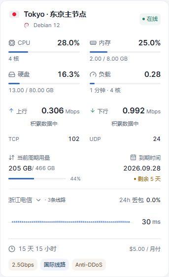 |
| PC 延迟分析 | 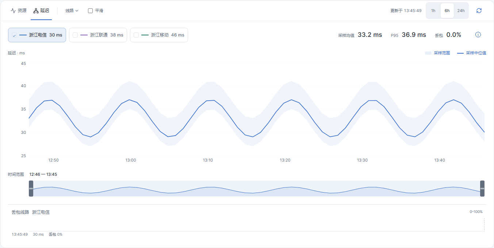 |
| 手机延迟分析 | 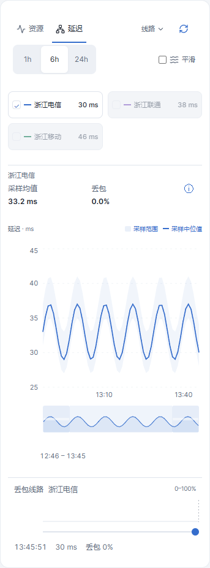 |

## 延迟布局历史截图（v0.1.22 桌面排版修订）

以下为当前生产构建配合本地演示数据的实际截图。

| 页面 | 截图 |
| --- | --- |
| PC 延迟分析 | 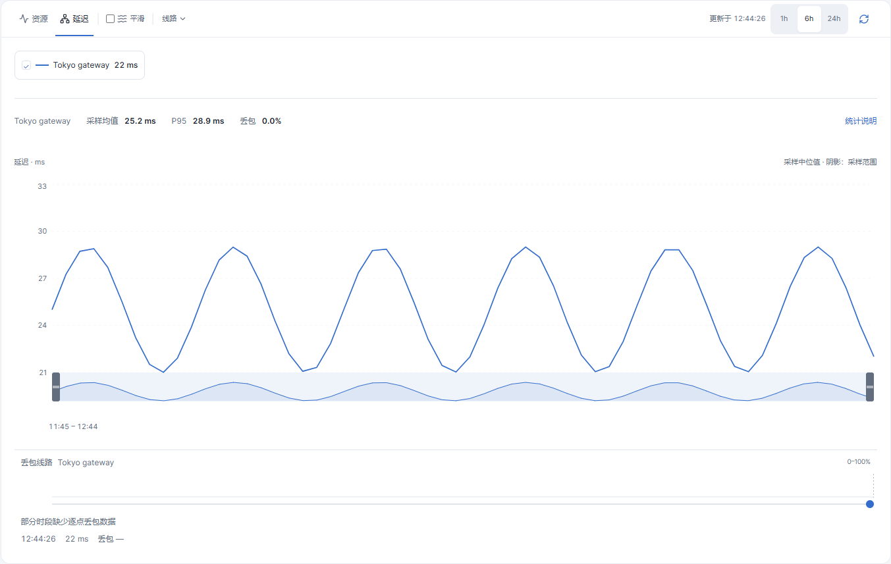 |
| 手机延迟分析 | 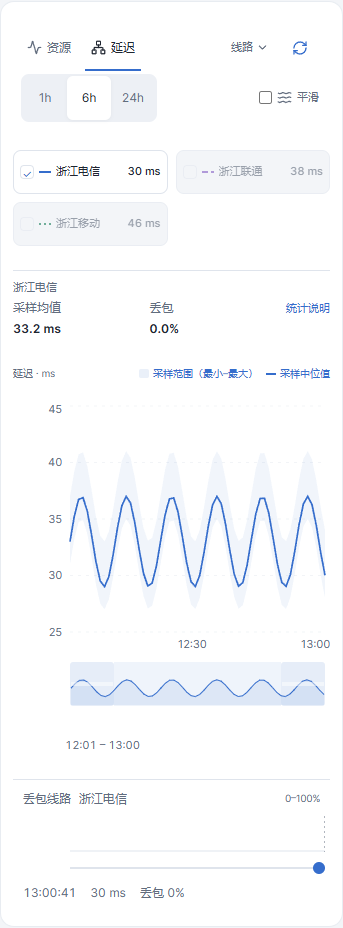 |

## 概览布局截图（v0.1.21）

以下为生产构建使用本地演示数据的实际截图；刚进入页面时，实时趋势会显示“积累数据中”。

| 页面 | 截图 |
| --- | --- |
| 首页紧凑卡片 | 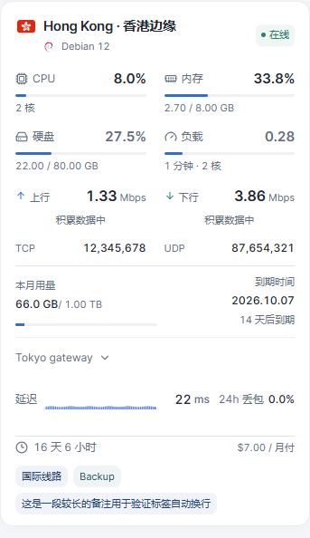 |
| PC 详情页 | 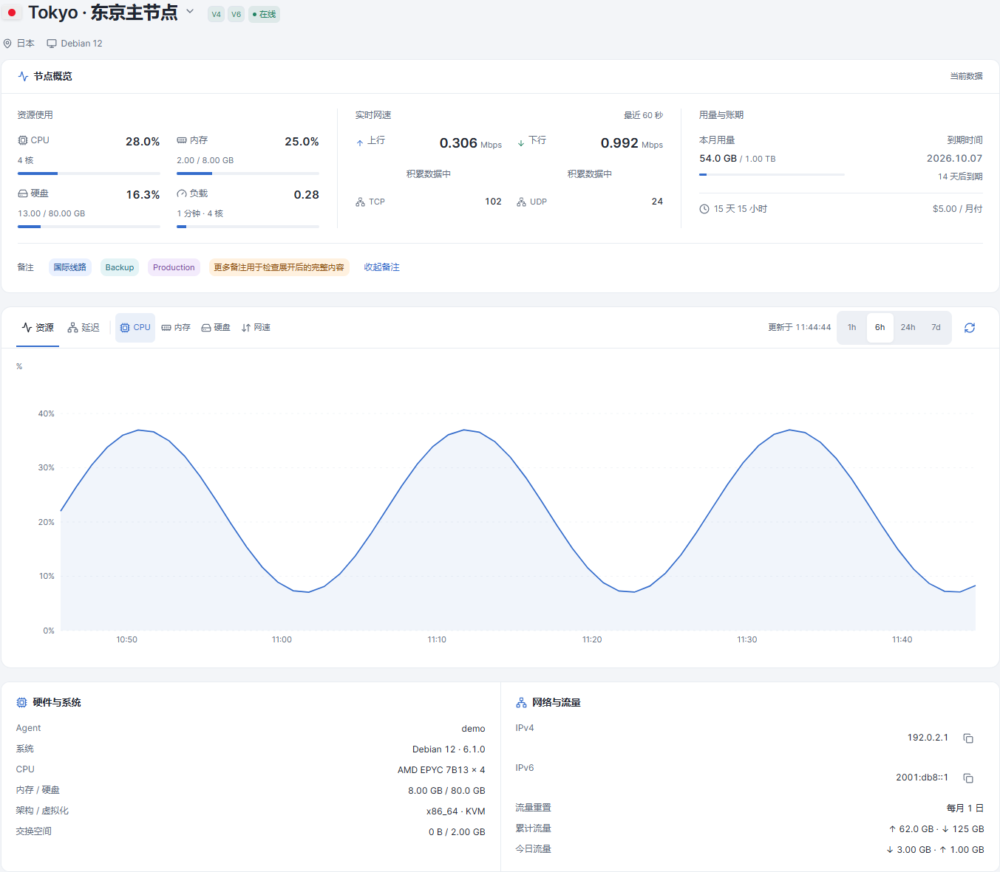 |
| PC 详情页深色 | 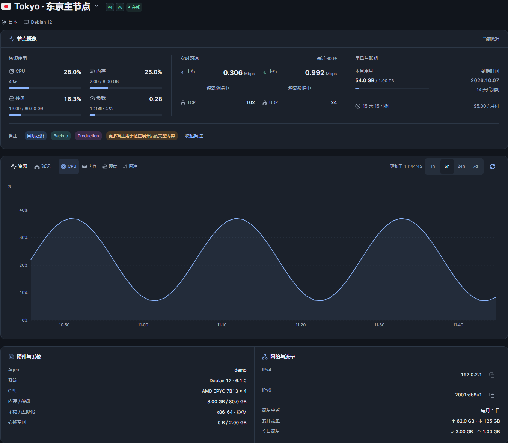 |
| 手机详情页 | 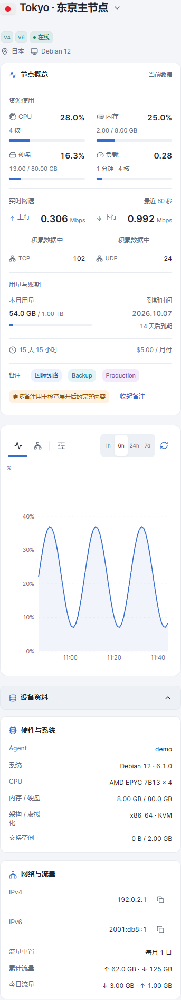 |


## v0.1.25 实际截图

| 手机首页卡片 | 桌面首页卡片 |
|---|---|
| 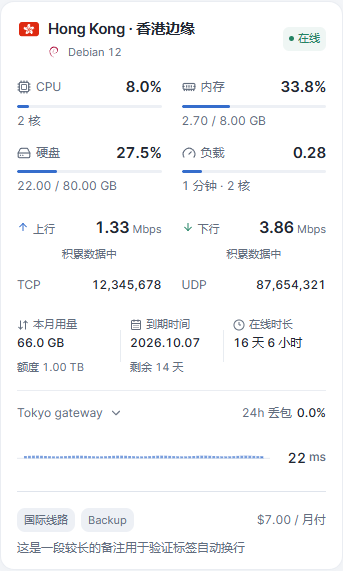 | 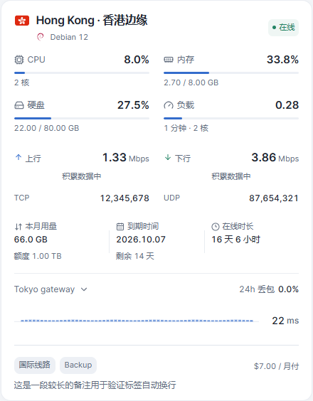 |

[桌面延迟面板](screenshots/route-controls/1440-latency-panel.png) · [手机延迟面板](screenshots/route-controls/390-latency-panel.png)


## v0.1.26 实际截图

| 手机首页卡片 | 桌面首页卡片 |
|---|---|
| 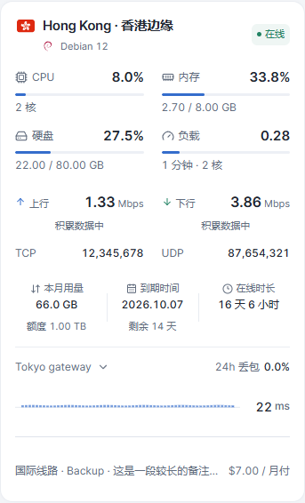 | 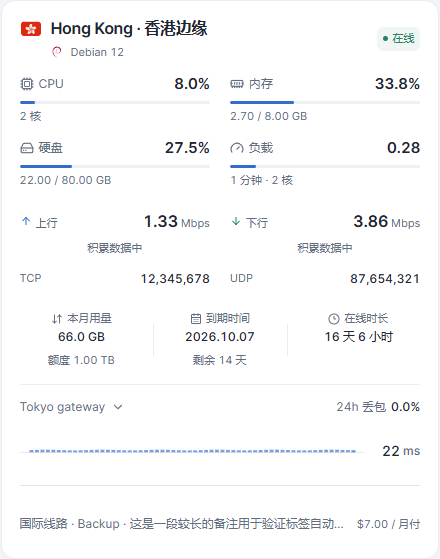 |


## v0.1.27 实际截图

[手机卡片](screenshots/card-connections/mobile.png) · [桌面卡片](screenshots/card-connections/desktop.png)
