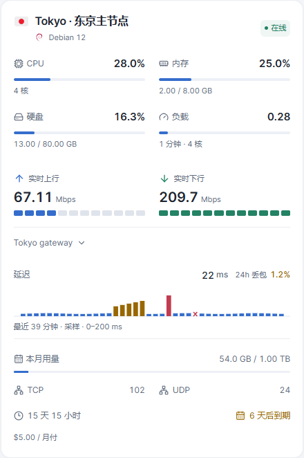
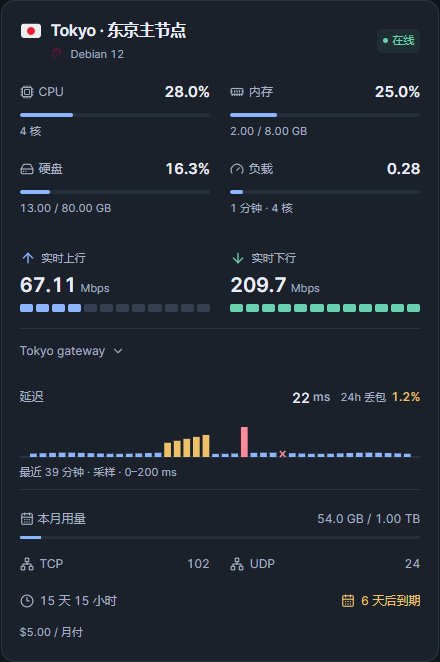
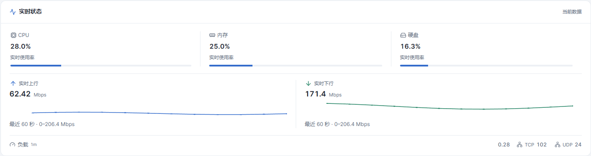
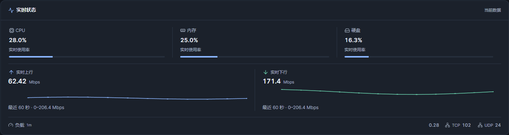
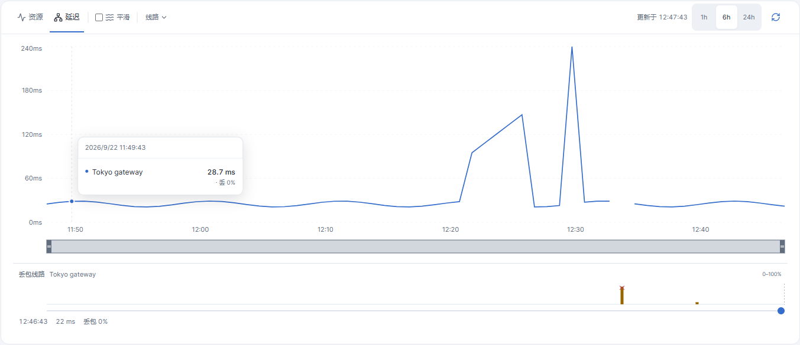
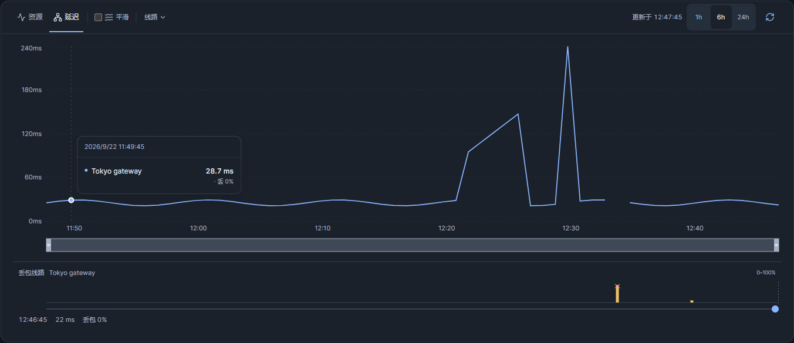

# Monitor HEX

HEX 是为 monitor-probe 制作的监控主题。当前版本 **0.1.3**，主题短名 **hex**。

本版本统一实际网速为 Mbps：首页采用固定活动分段条和统一刻度的延迟采样柱条，详情保留实时趋势与丢包轨道，并改善桌面资料标题间距。验收入口见 `ACCEPTANCE.md`。

## 安装

从 [最新 Release](https://github.com/8bitNull/monitor-theme-hex/releases/latest) 下载 **[theme.tar.gz](https://github.com/8bitNull/monitor-theme-hex/releases/latest/download/theme.tar.gz)**。

在后台主题管理上传 `theme.tar.gz`，然后选择 **Monitor HEX**。请勿上传源码 ZIP。安装包根目录包含 theme.json、dist、preview.png 和许可证。

手动安装时解压至主题目录下的 `hex/`。由于短名已更改，后台会识别为新主题，安装后需选择启用。页面顶栏的站点主名称仍遵循后台站点设置，主题标识为 MONITOR HEX。

## 默认显示

- 手机端（宽度不超过 720px）采用单行地区选择与图标式视图切换；点击地区打开底部面板，查看国旗、地区名称和节点数。首页隐藏地图，优先展示节点。
- 桌面地图默认 169% 缩放，默认聚焦北美、欧洲和东亚，可拖动、缩放、全屏及筛选地区。
- 默认资源样式为细进度条，卡片按身份、资源、网速、延迟、辅助资料排列；已有明确保存的样式选择继续保留。
- 总览为节点、今日流量、实时网速、高负载提示四栏，手机为两列。
- 首页默认一条线路，可在主题设置中调整为最多三条；详情页查看全部线路。
- 支持深浅色、资源与网速指标、备注标签及延迟历史图表。

## 网络指标

- 首页网速固定为蓝色上行、绿色下行的 12 段等高活动条，明确标注“实时上行／实时下行”。上下行共用近期峰值，立即扩张、逐步收缩；活动条不代表带宽利用率，不受 CPU／内存／硬盘样式切换影响。
- 实际速率来自已有 Agent 上报，按 `bytes/s × 8 ÷ 1,000,000` 转为 Mbps；首页、总览、表格、详情和历史坐标／提示统一。零值为 `0 Mbps`，正值小于 0.001 显示 `<0.001 Mbps`，离线／过期／缺失为 `—`。累计用量仍使用 GB／TB。
- 首页仅主线路展示最多 40 个真实采样的延迟柱条，按时间戳排列并标注跨度；其他线路保留数字。全卡片共用 200 ms 或 500 ms 刻度，可在设置 → 线路中选择；默认黄色阈值 80 ms、红色阈值 160 ms，可修改后应用。柱高表示延迟，超刻度封顶标红并保留真实读数，叉号表示超时，缺失时间留空。
- 设置字段 `latencyScale`（200／500）、`latencyWarn`、`latencyHigh` 可在 `public/theme-config.json` 配置，支持偏好导入导出。“恢复默认外观”保留延迟设置，“重置全部偏好”恢复站点默认；旧配置自动补齐默认值。
- 本轮不进行测速；当前接口没有按电信／联通／移动归属拆分的实际吞吐数据，因此不显示三网平均速率，也不以延迟推算速率。
- 详情页上下行趋势使用真实上报时间，展示最近 60 秒，每节点最多缓存 60 个样本；相同上报时间不重复采样。首次进入逐步积累，离线或过期显示明确状态。上下行使用共同尺度，单位标注刻度上限。
- 延迟历史图下方新增丢包时间轨道，跟随主图缩放范围。单线路自动跟随，多线路可选择“丢包线路”；短柱代表对应时间桶的丢包率，叉号代表超时。支持鼠标、点按及键盘滑块查看时间、延迟与丢包。
- 真实零值显示 0，未知统计显示 —；全窗口丢包率直接使用后端统计，不对时间桶百分比求平均。历史曲线和实时采样不新增轮询请求。

## 搜索与语言

桌面端搜索框位于页首主题设置左侧。手机端只显示放大镜入口，点击后在屏幕中央打开搜索框；搜索支持清除，长列表提供返回顶部操作。

手机和电脑端均可在右上角设置按钮 → **语言 / Language** 中选择 **简体中文** 或 **English**，即时生效并记住选择。

## 卡片显示自定义

在右上角设置 → **显示内容 → 卡片信息**，分别控制本月用量、TCP／UDP、在线时长、到期信息、备注和价格。仅控制首页卡片，详情页保留完整资料。

**完整**显示全部六项；**精简**隐藏 TCP／UDP 和在线时长，保留用量、到期、备注和价格。应用预设后仍可逐项修改，其他组合标记为**自定义**。手机独立方案也有自己的预设。预设不更改颜色、语言、指标样式、列数或地图；升级不会自动套用预设。

- **手机显示**默认跟随通用设置。选择“单独设置”后，仅对宽度不超过 720px 的卡片生效；第一次复制通用选项，再次开启会恢复已保存的手机方案。
- **桌面列数**位于卡片信息分组下方，可选自动、2、3、4 列。自动保持原布局；手动列数受卡片最小宽度 300px 限制，窗口较窄时自动降列。手机保持单列。
- **高级外观**默认折叠，包含背景、模糊、遮罩与玻璃效果。
- “恢复默认外观”保留卡片显示与列数选择；“重置全部偏好”重新跟随站点默认。导入导出包含新选项，旧配置仍可使用。
- 偏好保存在当前浏览器，不跨设备同步。站点默认可在 `public/theme-config.json` 中设置 `cardInfo`、`mobileInfoMode`、`mobileCardInfo`、`desktopColumns`；列数值使用字符串 `"auto"`、`"2"`、`"3"`、`"4"`。

## 高负载记录

在主题设置中开启高负载提示。CPU 达到 85% 开始记录，低于 80% 标为恢复，避免阈值附近反复闪动。第四栏显示当前告警数量及最近事件，点击可查看开始、恢复或最后观测时间、持续时长（时:分:秒）及 CPU 峰值。

记录保存在当前站点、当前浏览器，最多保留最近 100 条结束记录，正在进行的记录保留。关闭提示不清除历史。详情页停留期间继续监测；页面关闭期间无法监测，重开后未确认结束的事件标记为监测中断，持续时长只计算已观测时段。存储不可用时会显示提示。它不是服务端全天候告警日志，不在设备间同步。

为兼容原主题，浏览器偏好与历史存储键保留原来的内部名称；安装不修改服务器数据。更改主题短名后，后台主题默认设置如有自定义，请在新主题中重新确认。

## 开发与验收

`npm install`、`npm run build`、`npm run lint`、`npm test`。`npm run demo` 启动演示数据页面；`npm run package` 生成 theme.tar.gz。浏览器测试按功能组织，运行 `npm run test:e2e` 检查当前版本的 160 项交互用例（需已安装 Chrome）；设置 `TEST_BROWSER=msedge` 可改用 Edge。测试前先执行 `npm run build`。

截图由当前生产构建配合本地演示数据生成，不代表已部署至用户线上站点。许可和参考来源见 NOTICE.md、LICENSE、LICENSE.komari-next。

## 详情页

详情页按设备资料、实时状态、历史图表阅读。桌面资料区按硬件与系统、网络与流量、费用与到期组成三列网格，实时状态独立为全宽模块，历史图表位于最下方；手机资料按三组折叠后依次展示实时状态和历史图表。PC 端不重复显示设备资料标题，CPU 保持纯文本展示，IPv4 和 IPv6 等适合复制的资料保留复制按钮。

- 资源主图可切换四项指标，手机点按数据点查看提示；图表提示支持关闭、点外部关闭和内部滚动。
- 延迟工具栏提供平滑显示和线路多选菜单；线路可逐项显示或隐藏，菜单展示延迟和丢包率。资源指标在桌面直接切换，手机通过指标菜单选择。
- 打开线路面板时已选项优先，多选期间保持顺序；Escape 关闭面板并返回入口焦点。
- 线路使用固定颜色与有限虚实线组合，切换范围或隐藏后恢复时样式稳定，图例与曲线保持对应。
- 失败刷新保留同范围的上次成功记录，并直接展示上次成功时间；切换范围不会沿用其他范围的时间。
- 超长名称默认最多两行，可独立展开；长备注使用自然换行；复制成功提示短暂显示，失败可重试。
- 历史工具栏保持单行：资源时间范围为 `1h`、`6h`、`24h`、`7d`，延迟时间范围为 `1h`、`6h`、`24h`。手机收起标签文字并使用紧凑控件，时间组不会拆分或遮挡刷新按钮。

设置 → **详情页 → 设备资料展开方式**提供自动、展开、折叠。自动模式在 900px 以下折叠、900px 及以上展开；手动展开或折叠会记住选择。可在设置中恢复自动。偏好支持导入导出，“恢复默认外观”保留该选择，“重置全部偏好”恢复站点默认。资料按硬件与系统、网络与流量、费用与到期分组。CPU、内存、硬盘组成主要读数组；负载与 TCP/UDP 作为辅助信息，离线时显示未知值。长名称展开入口在标题下方，长备注展开后使用自然换行的轻量文本。可复制的长资料与按钮分列，完整原值仍可复制。

## 本地开发与 GitHub 同步

源码仓库：https://github.com/8bitNull/monitor-theme-hex

使用 Node.js 24 与 npm。首次准备开发环境：

```sh
npm ci
npm run dev
```

生产检查与打包：

```sh
npm run lint
npm test
npm run package
```

生成的 `theme.tar.gz` 用于后台安装。依赖、构建文件和安装包不提交到源码仓库；安装包通过 [GitHub Releases](https://github.com/8bitNull/monitor-theme-hex/releases) 发布。

每次开发前，在工作区没有未提交修改时运行 `git pull --ff-only` 获取远端更新。修改完成后检查并上传：

```sh
git status
git diff
git add .
git commit -m "说明本次修改"
git push
```

保存文件不会自动上传；提交并推送后才会同步至 GitHub。当前版本检查说明见 `ACCEPTANCE.md`。浏览器测试和截图脚本的原始图片保存在 `tests/artifacts/`，不提交到源码仓库；用于首页展示的精选图片保存在 `screenshots/`。

## 网络指标截图（v0.1.2）

以下为本版本生产构建与本地演示数据的实际截图。

| 场景 | 浅色 | 深色 |
| --- | --- | --- |
| 首页网速与主线路微趋势 |  |  |
| 详情实时网速趋势 |  |  |
| 延迟与丢包时间轨道 |  |  |

## 页面布局参考截图

以下保留此前版本的整体布局截图；网络指标的当前样式以上方 v0.1.2 截图为准。

| 页面 | 截图 |
| --- | --- |
| 首页仪表盘（浅色） |  |
| 首页仪表盘（深色） |  |
| 手机首页（浅色） |  |
| 手机首页（深色） |  |
| 显示设置（桌面） |  |
| 显示设置（手机） |  |
| 详情页资源 |  |
| 详情页延迟 |  |
| 移动端详情与对比（浅色） |  |
| 移动端详情与对比（深色） |  |
