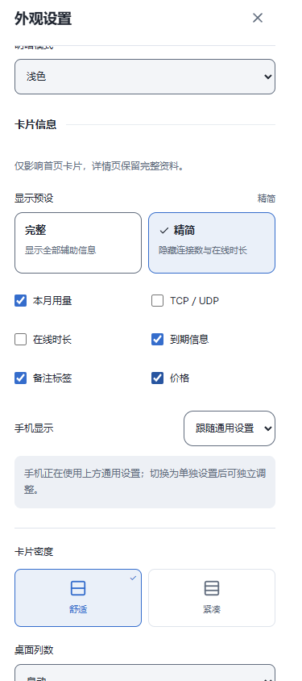
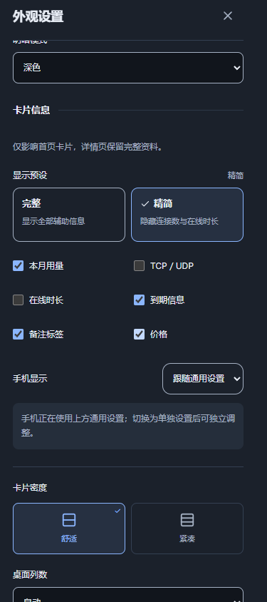
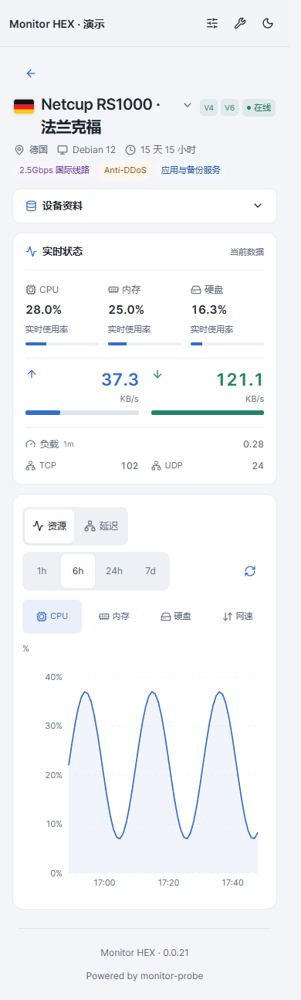
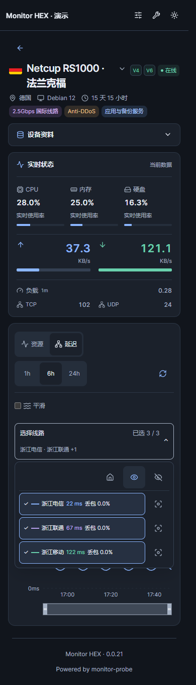
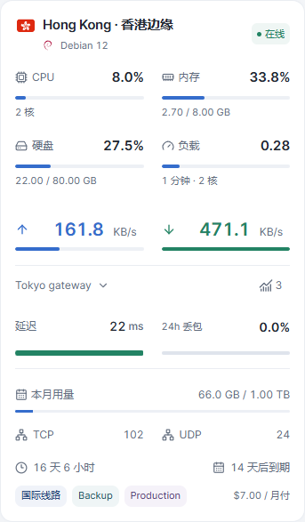
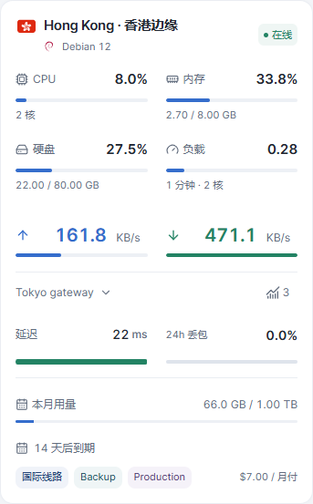

# Monitor HEX

HEX 是为 monitor-probe 制作的监控主题。当前版本 **0.0.21**，主题短名 **hex**。

**0.0.21** 将详情页改为模块化网格阅读：设备资料置顶，实时状态独立展示，历史图表全宽排列；浅色模块统一白底，线路操作收进线路面板。验收入口见 `ACCEPTANCE.md`。

## 主题预览

以下图片均为 **v0.0.21**，使用本地演示数据。移动端首页展示上半部分，点击图片可查看原图。

| 浅色首页 | 深色首页 |
| --- | --- |
|  |  |

<p align="center">
  
  
</p>

| 浅色显示设置 | 深色显示设置 |
| --- | --- |
|  |  |

## 详情页预览

| 资源详情 | 延迟图表 |
| --- | --- |
|  |  |

<p align="center">
  
  
</p>

## 安装

从 [最新 Release](https://github.com/8bitNull/Monitor-Hex/releases/latest) 下载 **[theme.tar.gz](https://github.com/8bitNull/Monitor-Hex/releases/latest/download/theme.tar.gz)**。

在后台主题管理上传 `theme.tar.gz`，然后选择 **Monitor HEX**。请勿上传源码 ZIP。安装包根目录包含 theme.json、dist、preview.png 和许可证。

手动安装时解压至主题目录下的 `hex/`。由于短名已更改，后台会识别为新主题，安装后需选择启用。页面顶栏的站点主名称仍遵循后台站点设置，主题标识为 MONITOR HEX。

## 语言切换

手机和电脑端均在右上角设置按钮 → **语言 / Language** 中选择 **简体中文** 或 **English**，即时生效并记住选择。

## 默认显示

- 手机端（宽度不超过 720px）采用单行地区选择与图标式视图切换；点击地区打开底部面板，查看国旗、地区名称和节点数。首页隐藏地图，优先展示节点。
- 桌面地图默认 169% 缩放，默认聚焦北美、欧洲和东亚，可拖动、缩放、全屏及筛选地区。
- 默认资源样式为细进度条，卡片按身份、资源、网速、延迟、辅助资料排列；已有明确保存的样式选择继续保留。
- 总览为节点、今日流量、实时网速、高负载提示四栏，手机为两列。
- 首页默认一条线路，可在主题设置中调整为最多三条；详情页查看全部线路。
- 支持深浅色、资源与网速指标、备注标签及延迟历史图表。

## 卡片显示自定义

在右上角设置 → **显示内容 → 卡片信息**，分别控制本月用量、TCP／UDP、在线时长、到期信息、备注和价格。仅控制首页卡片，详情页保留完整资料。

**完整**显示全部六项；**精简**隐藏 TCP／UDP 和在线时长，保留用量、到期、备注和价格。应用预设后仍可逐项修改，其他组合标记为**自定义**。手机独立方案也有自己的预设。预设不更改颜色、语言、指标样式、列数或地图；升级不会自动套用预设。

- **手机显示**默认跟随通用设置。选择“单独设置”后，仅对宽度不超过 720px 的卡片生效；第一次复制通用选项，再次开启会恢复已保存的手机方案。
- **桌面列数**位于卡片信息分组下方，可选自动、2、3、4 列。自动保持原布局；手动列数受卡片最小宽度 300px 限制，窗口较窄时自动降列。手机保持单列。
- **高级外观**默认折叠，包含背景、模糊、遮罩与玻璃效果。
- “恢复默认外观”保留卡片显示与列数选择；“重置全部偏好”重新跟随站点默认。导入导出包含新选项，旧配置仍可使用。
- 偏好保存在当前浏览器，不跨设备同步。站点默认可在 public/theme-config.json 中设置 cardInfo、mobileInfoMode、mobileCardInfo、desktopColumns；列数值使用字符串 "auto"、"2"、"3"、"4"。

| 完整卡片 | 精简卡片 |
| --- | --- |
|  |  |

## 高负载记录

在主题设置中开启高负载提示。CPU 达到 85% 开始记录，低于 80% 标为恢复，避免阈值附近反复闪动。第四栏显示当前告警数量及最近事件，点击可查看开始、恢复或最后观测时间、持续时长（时:分:秒）及 CPU 峰值。

记录保存在当前站点、当前浏览器，最多保留最近 100 条结束记录，正在进行的记录保留。关闭提示不清除历史。详情页停留期间继续监测；页面关闭期间无法监测，重开后未确认结束的事件标记为监测中断，持续时长只计算已观测时段。存储不可用时会显示提示。它不是服务端全天候告警日志，不在设备间同步。

为兼容原主题，浏览器偏好与历史存储键保留原来的内部名称；安装不修改服务器数据。更改主题短名后，后台主题默认设置如有自定义，请在新主题中重新确认。

## 开发与验收

`npm install`、`npm run build`、`npm run lint`、`npm test`。`npm run demo` 启动演示数据页面；`npm run package` 生成 theme.tar.gz。浏览器测试按功能组织，运行 `npm run test:e2e` 检查当前版本的 142 项交互用例（需已安装 Chrome）；设置 `TEST_BROWSER=msedge` 可改用 Edge。测试前先执行 `npm run build`。

截图由当前生产构建配合本地演示数据生成，不代表已部署至用户线上站点。许可和参考来源见 NOTICE.md、LICENSE、LICENSE.komari-next。

## 详情页

详情页统一按设备资料、实时状态、历史图表阅读。桌面资料区按硬件与系统、网络与流量、费用与到期组成三列网格，实时状态独立为全宽白色模块，历史图表位于最下方；手机折叠资料后依次展示实时状态和历史图表。资源主图可切换四项指标，手机点按数据点查看提示。较多或较长备注可展开查看；Agent 版本位于硬件资料，负载与 TCP/UDP 保留在实时状态辅助区。延迟线路超过 6 条时支持名称搜索；搜索只筛选列表，全部显示、全部隐藏和恢复首页线路仍作用于完整线路集合。打开面板时已选优先，连续多选期间保持顺序，避免滚动跳动；Escape 关闭并返回入口焦点。手机图表提示可点击关闭或点外部关闭，时间与关闭按钮同排，长提示可内部滚动；提示宽度受实际绘图区约束。名称与数值分列，延迟最多显示一位小数。线路使用固定颜色与有限虚实线组合，切换范围或隐藏后恢复时样式稳定，图例与曲线对应。提示列表沿用线路选择面板顺序，避免名称字典排序。1200px 起在工具栏显示更新时间；失败时标注保留上次记录，切换范围不会沿用其他范围的成功时间。刷新失败且保留同范围记录时，所有屏幕均在提示中直接展示上次成功时间。超长名称默认最多两行，可独立展开；复制成功提示 2 秒后消失，失败可重试。

设置 → **详情页 → 设备资料展开方式**提供自动、展开、折叠。自动模式在 900px 以下折叠、900px 及以上展开；手动展开或折叠会记住选择。可在设置中恢复自动。偏好支持导入导出，“恢复默认外观”保留该选择，“重置全部偏好”恢复站点默认。资料按硬件与系统、网络与流量、费用与到期分组。CPU、内存、硬盘组成主要读数组；负载与 TCP/UDP 作为辅助信息，离线时显示未知值。长名称展开入口在标题下方，长备注展开后使用自然换行的轻量文本。可复制的长资料与按钮分列，完整原值仍可复制。

## 本地开发与 GitHub 同步

源码仓库：https://github.com/8bitNull/Monitor-Hex

使用 Node.js 24 与 npm。首次准备开发环境：

```sh
npm ci
npm run dev
```

生产检查与打包：

```sh
npm run lint
npm test
npm run package
```

生成的 `theme.tar.gz` 用于后台安装。依赖、构建文件和安装包不提交到源码仓库；安装包通过 [GitHub Releases](https://github.com/8bitNull/Monitor-Hex/releases) 发布。

每次开发前，在工作区没有未提交修改时运行 `git pull --ff-only` 获取远端更新。修改完成后检查并上传：

```sh
git status
git diff
git add .
git commit -m "说明本次修改"
git push
```

保存文件不会自动上传；提交并推送后才会同步至 GitHub。当前版本检查说明见 `ACCEPTANCE.md`。浏览器测试和截图脚本的原始图片保存在 `tests/artifacts/`，不提交到源码仓库；用于首页展示的精选图片保存在 `screenshots/`。

### v0.0.21 详情页模块化网格

- 设备资料在详情页上方按硬件与系统、网络与流量、费用与到期分成三张白色卡片；桌面三列，手机单列并保留自动折叠偏好。
- 实时状态独立展示 CPU、内存、硬盘使用率、网速、负载和连接数；静态容量、架构和系统信息不再重复出现在实时区域。
- 历史资源与延迟图表统一位于底部全宽模块；线路批量操作集中在选择线路面板，图标操作保持 44px 触控区域。
- 新增详情网格顺序、白底背景、重复信息移除、模块图标和 320/390px 无溢出专项验收。

### v0.0.20 阅读与线路操作

- 线路面板每行右侧的聚焦图标可“仅看此线路”，面板顶部提供“恢复之前选择”。连续查看不同单线路仍恢复首次操作前的选择，包括首页继承和全部隐藏；修改勾选或使用全部/首页按钮后结束这次临时查看。切换时间范围保留临时恢复入口，刷新页面或切换节点不保留恢复历史。
- 图表提示使用小色点标识线路，名称与读数使用中性色；丢包辅助信息弱化，未知值仍显示 —，不视作零丢包。
- 资源与延迟图表的提示支持 Escape 关闭；下一次移动鼠标、点击数据点或使用图表方向键可重新查看。焦点在手机关闭按钮上时，关闭后返回图表。
- 手机超过 32 字符的资料值排在标签下方，CPU、IPv6 完整换行并保留 44px 复制按钮。不新增设置项。
