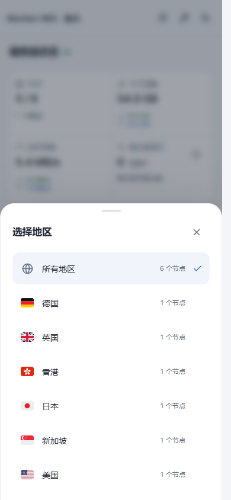
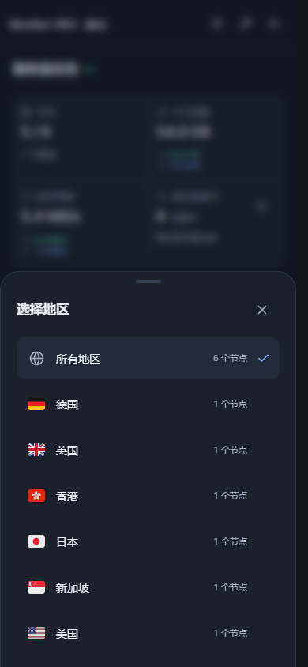
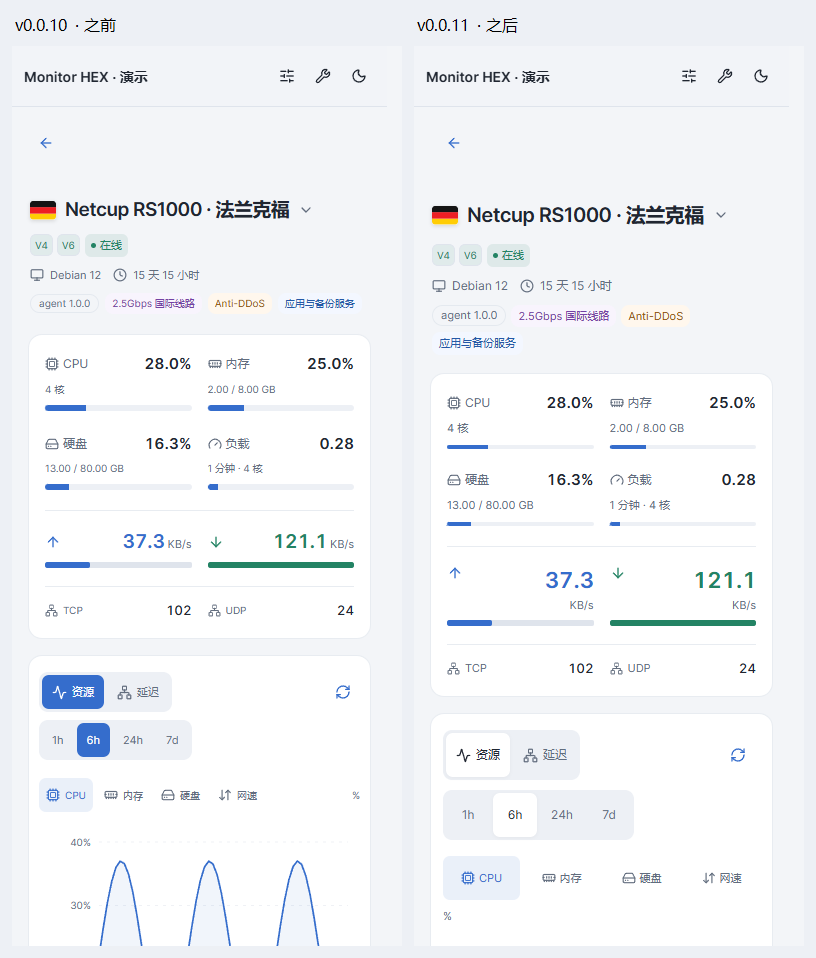
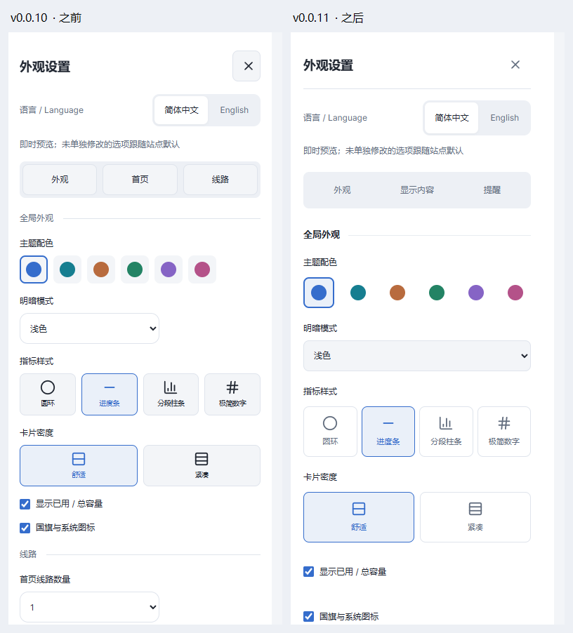
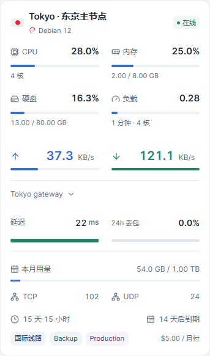
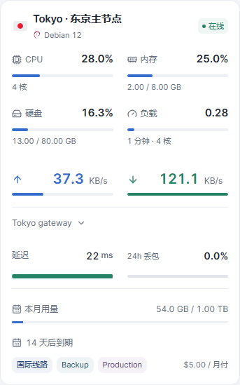
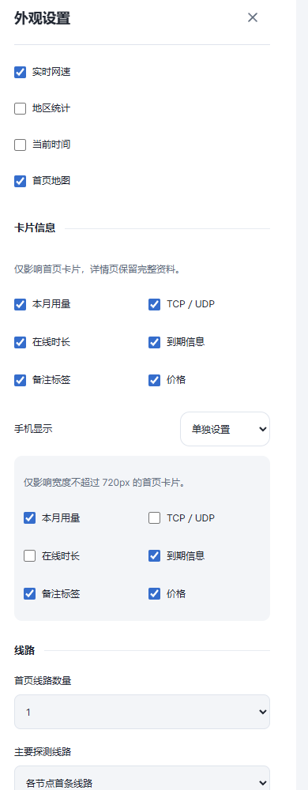
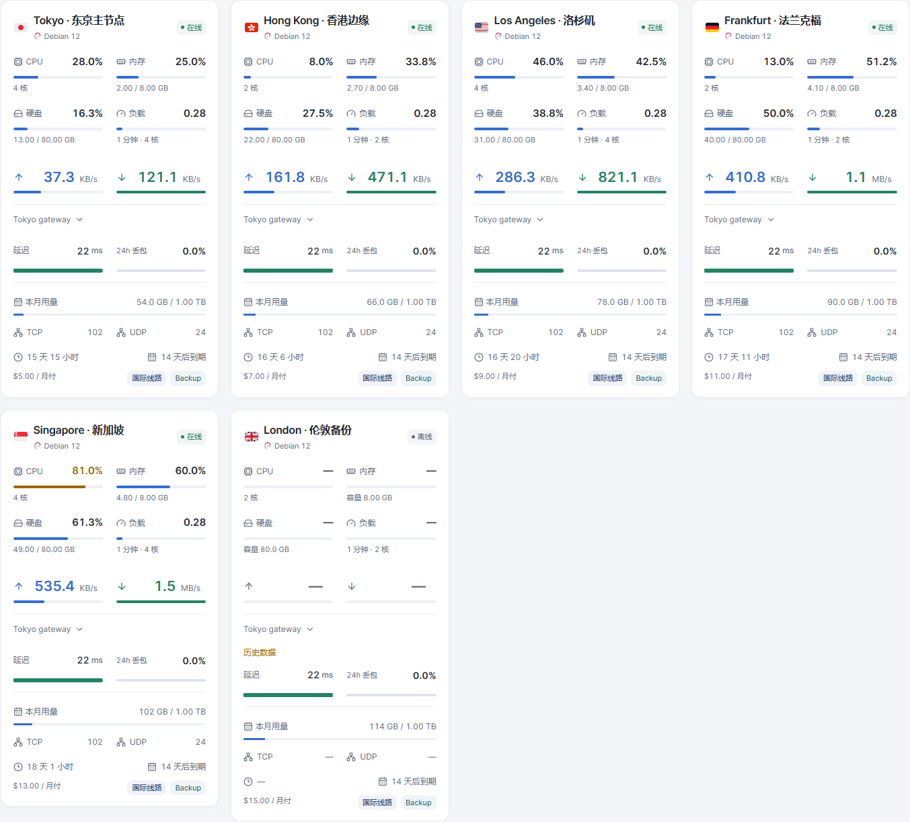

# Monitor HEX

HEX 是为 monitor-probe 制作的监控主题。当前版本 **0.0.13**，主题短名 **hex**。

**0.0.13** 新增卡片辅助信息开关、手机独立显示设置和桌面列数。默认保持原版外观。验收见 [REVIEW-v0.0.13.md](REVIEW-v0.0.13.md)。

## 主题预览

以下图片使用本地演示数据，首页与自定义预览展示 0.0.13，详情和设置保留 0.0.11 预览。移动端首页图片展示上半部分。点击图片可查看原图。

| 浅色首页 | 深色首页 |
| --- | --- |
|  |  |

| 节点资源详情 | 多线路延迟历史 |
| --- | --- |
|  |  |

<p align="center">
  
  
</p>

<details>
<summary>地区选择面板（浅色 / 深色）</summary>
<p>
  
  
</p>
</details>

<details>
<summary>v0.0.10 手机首页精修前后对比（左旧版，右新版）</summary>


</details>

<details>
<summary>v0.0.11 详情页与设置面板精修（左旧版，右新版）</summary>




</details>

## 安装

从 [最新 Release](https://github.com/8bitNull/Monitor-Hex/releases/latest) 下载 **[theme.tar.gz](https://github.com/8bitNull/Monitor-Hex/releases/latest/download/theme.tar.gz)**。

在后台主题管理上传 `theme.tar.gz`，然后选择 **Monitor HEX**。请勿上传源码 ZIP。安装包根目录包含 theme.json、dist、preview.png 和许可证。

手动安装时解压至主题目录下的 `hex/`。由于短名已更改，后台会识别为新主题，安装后需选择启用。页面顶栏的站点主名称仍遵循后台站点设置，主题标识为 MONITOR HEX。

## 语言切换

手机和电脑端均在右上角设置按钮 → **语言 / Language** 中选择 **简体中文** 或 **English**，即时生效并记住选择。

## 默认显示

- 手机端（宽度不超过 720px）采用单行地区选择与图标式视图切换；点击地区打开底部面板，查看国旗、地区名称和节点数。首页隐藏地图，优先展示节点。
- 桌面地图默认 169% 缩放，默认聚焦北美、欧洲和东亚，可拖动、缩放、全屏及筛选地区。
- 默认资源样式为细进度条，卡片按身份、资源、网速、延迟、辅助资料排列；已有明确保存的样式选择继续保留。
- 总览为节点、今日流量、实时网速、高负载提示四栏，手机为两列。
- 首页默认一条线路，可在主题设置中调整为最多三条；详情页查看全部线路。
- 支持深浅色、资源与网速指标、备注标签及延迟历史图表。

## 卡片显示自定义

在右上角设置 → **显示内容 → 卡片信息**，分别控制本月用量、TCP／UDP、在线时长、到期信息、备注和价格。仅控制首页卡片，详情页保留完整资料。

- **手机显示**默认跟随通用设置。选择“单独设置”后，仅对宽度不超过 720px 的卡片生效；第一次复制通用选项，再次开启会恢复已保存的手机方案。
- **桌面列数**位于外观分组，可选自动、2、3、4 列。自动保持原布局；手动列数受卡片最小宽度 300px 限制，窗口较窄时自动降列。手机保持单列。
- **高级外观**默认折叠，包含背景、模糊、遮罩与玻璃效果。
- “恢复默认外观”保留卡片显示与列数选择；“重置全部偏好”重新跟随站点默认。导入导出包含新选项，旧配置仍可使用。
- 偏好保存在当前浏览器，不跨设备同步。站点默认可在 public/theme-config.json 中设置 cardInfo、mobileInfoMode、mobileCardInfo、desktopColumns；列数值使用字符串 "auto"、"2"、"3"、"4"。

| 默认手机卡片 | 手机精简示例 |
| --- | --- |
|  |  |

<details><summary>设置面板与桌面四列预览</summary>




</details>

## 高负载记录

在主题设置中开启高负载提示。CPU 达到 85% 开始记录，低于 80% 标为恢复，避免阈值附近反复闪动。第四栏显示当前告警数量及最近事件，点击可查看开始、恢复或最后观测时间、持续时长（时:分:秒）及 CPU 峰值。

记录保存在当前站点、当前浏览器，最多保留最近 100 条结束记录，正在进行的记录保留。关闭提示不清除历史。详情页停留期间继续监测；页面关闭期间无法监测，重开后未确认结束的事件标记为监测中断，持续时长只计算已观测时段。存储不可用时会显示提示。它不是服务端全天候告警日志，不在设备间同步。

为兼容原主题，浏览器偏好与历史存储键保留原来的内部名称；安装不修改服务器数据。更改主题短名后，后台主题默认设置如有自定义，请在新主题中重新确认。

## 开发与验收

`npm install`、`npm run build`、`npm run lint`、`npm test`。`npm run demo` 启动演示数据页面；`npm run package` 生成 theme.tar.gz。浏览器测试按功能组织，运行 `npm run test:e2e` 检查当前版本的 58 项交互用例（需已安装 Chrome）；设置 `TEST_BROWSER=msedge` 可改用 Edge。测试前先执行 `npm run build`。

截图由当前生产构建配合本地演示数据生成，不代表已部署至用户线上站点。许可和参考来源见 NOTICE.md、LICENSE、LICENSE.komari-next。

## 详情页

桌面采用 320px（中等屏幕 280px）概况栏与自适应历史图表。900px 以下按身份、实时指标、历史分析、流量与设备资料排序。资源主图可切换四项指标；备注在 Agent 后完整显示，TCP/UDP 常驻。详情样式统一在 detail.css；构建及验收报告随版本交付。

## 本地开发与 GitHub 同步

源码仓库：https://github.com/8bitNull/Monitor-Hex

使用 Node.js 24 与 npm。首次准备开发环境：

```sh
npm ci
npm run dev
```

生产检查与打包：

```sh
npm run lint
npm test
npm run package
```

生成的 `theme.tar.gz` 用于后台安装。依赖、构建文件和安装包不提交到源码仓库；安装包通过 [GitHub Releases](https://github.com/8bitNull/Monitor-Hex/releases) 发布。

每次开发前，在工作区没有未提交修改时运行 `git pull --ff-only` 获取远端更新。修改完成后检查并上传：

```sh
git status
git diff
git add .
git commit -m "说明本次修改"
git push
```

保存文件不会自动上传；提交并推送后才会同步至 GitHub。当前版本检查说明见 `ACCEPTANCE.md`。浏览器测试和截图脚本的原始图片保存在 `tests/artifacts/`，不提交到源码仓库；用于首页展示的精选图片保存在 `screenshots/`。