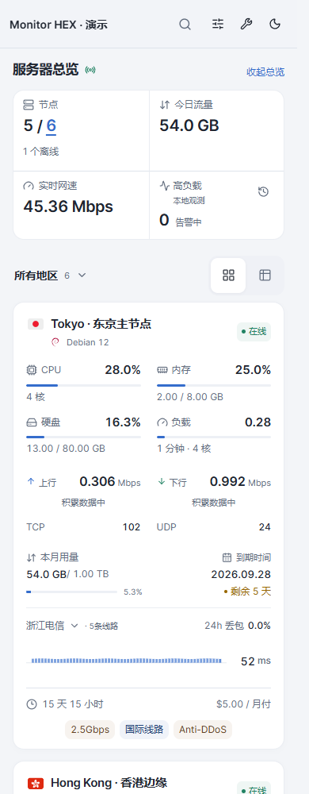
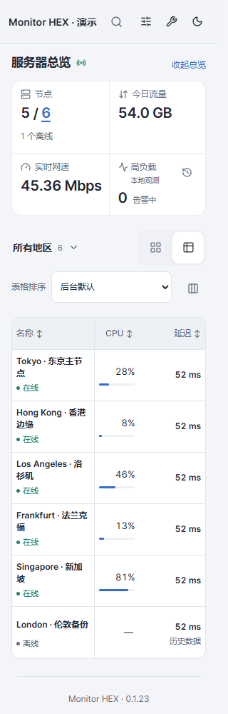
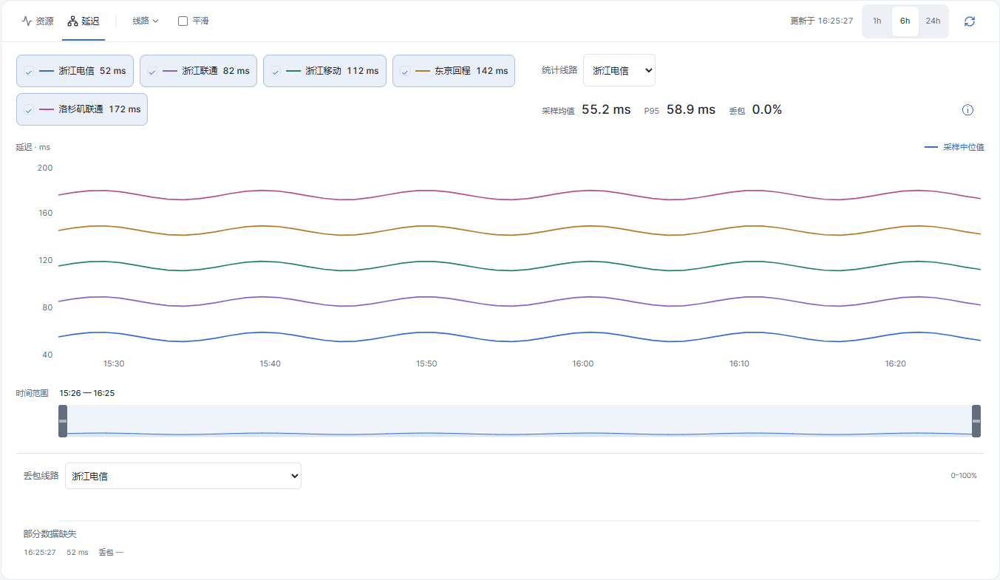
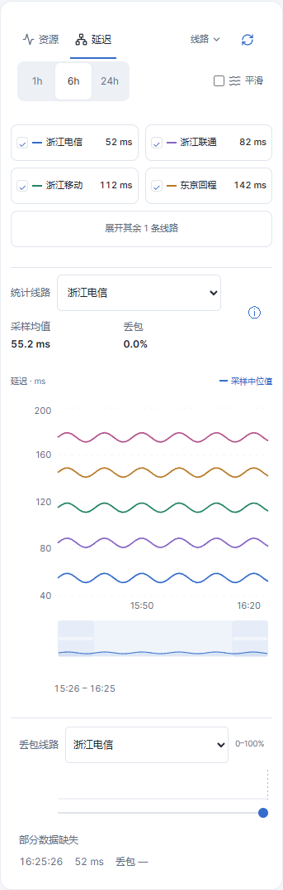
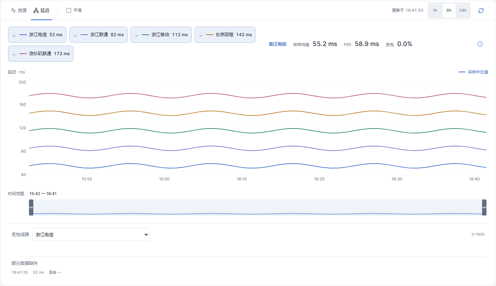
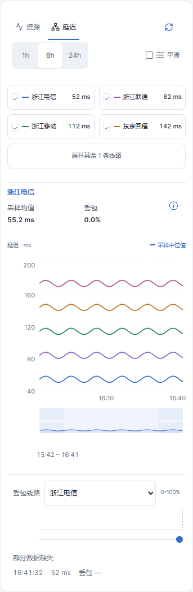

# 14项体验优化实施记录

本轮在 v0.1.23 基础上完成，随 v0.1.24 发布。保留已有 API 和旧配置解析能力。

## 改动与入口

| 项目 | 已实现行为 | 主要文件 |
|---|---|---|
| 1 设置语义 | 修正网速说明；取消重复资料密度控件，布局由舒适/紧凑控制；推荐按钮明确保留字段 | Preferences、NodeCard |
| 2 手机表格 | 地区/视图与排序/列设置分行；名称合并状态；新访客默认名称/CPU/延迟三列；自定义列保留横滑提示 | App、NodeTable、browse |
| 3 状态筛选 | 总览在线/全部/离线数量可点击；与搜索、地区、系统组合，显示匹配数量及可清除标签 | App、Summary |
| 4 详情工具栏 | 900px以下资源/延迟均两行，保留文字和当前资源名；范围与刷新44px命中区，锚点避让页头 | DetailToolbar、ux-review.css |
| 5 线路图例 | 桌面全部显示；手机前四条加展开/收起；稳定颜色和实线保留 | NodeDetail |
| 6 丢包统计 | 缩放时解释不可统计；上方统计线路与下方丢包线路双向同步 | NodeDetail、LossTrack |
| 7 卡片层级 | 资源/用量/到期分组保留，辅助文字提高可读性；价格右对齐；短备注居中、长备注换行 | NodeCard、ux-review.css |
| 8 手机总览 | 可收起为在线/离线、速率、高负载摘要；尊重模块开关，记住当前浏览器偏好 | Summary、appearance |
| 9 设置作用域 | 更名显示与偏好；桌面专属标记；高级外观折叠，保留现有偏好导入导出 | Preferences |
| 10 手机搜索 | 查看结果按钮、回车提交、输入法组字保护、零结果清空；关闭后焦点与滚动定位结果列表 | MobileSearch、App |
| 11 地图帮助 | 常驻帮助入口；选区在线/总数及清除按钮；地区列表与键盘操作保留 | WorldMap |
| 12 缩放无障碍 | 起止手柄读屏标签、实际日期、合法范围；兼容原有指针和方向键操作 | useBrushAccessibility |
| 13 记录来源 | 首页本地观测标记；高负载观测记录标题；规则折叠且来源说明常驻 | LoadAlertTile |
| 14 空态操作 | 未选线路→选择线路；空历史→时间范围；失败→重试；保留旧图提示；不存在节点与筛选空态保留恢复入口 | HistoryState、NodeDetail、App |

## 配置与兼容

- 新增 `summaryCollapsed`，默认 `false`，仅影响720px及以下总览；支持偏好导入导出。仅恢复外观保留此值，全部重置恢复站点默认。
- `infoDensity` 作为旧配置字段继续解析，卡片间距改由 `layout` 统一控制；不会覆盖已选择的辅助字段。
- 新表格默认仅用于没有 `mobileColumns` 的配置，已有自定义数组（包括空数组）保持不变。
- 状态筛选与地区、系统、关键词取交集；总览统计维持全站范围，匹配数表示当前列表结果。
- 移动端指首页720px及以下；详情页在900px以下使用紧凑工具栏和设备资料折叠，两个断点沿用原有布局职责。

## 验证与截图

- 构建、lint、业务单测全部通过；564项字面量翻译覆盖检查通过；Playwright完整回归206项全部通过。
- 新增8项交互回归，覆盖状态筛选、总览持久化、搜索提交、320/360/390/430px表格、8线路图例、统计同步、键盘缩放、首次请求失败及空态恢复、320px工具栏和高级设置。
- 既有测试更新的是已确认的行为变更：手机表格列数、双行资源工具栏、设置名称、折叠高级外观和取消重复资料密度。
- 新增截图覆盖320/360/390/430/1280/1440/1920px，延迟深浅模式，以及320/390/1440px英文页。截图与页面横向溢出测量保存在 `screenshots/ux-review/`。
- 浏览器验证为Chrome及移动视口模拟；真实手机软键盘、Safari/Android触摸与真实读屏软件仍需设备验收。真实后台登录和实际采样链路不在本地演示服务验证范围内。

## v0.1.25：精简延迟线路入口

- 删除平滑旁的线路菜单和摘要中的统计线路下拉框；图例仍可逐项显示/隐藏，手机保留四条及展开入口。
- 摘要直接显示所属线路，用曲线同色文字标识；桌面与指标同排，手机独占一行。
- 下方丢包线路选择统一控制摘要与缩略图。单线路自动跟随；隐藏当前线路自动切换到剩余可见线路，重新显示旧线路不抢回统计焦点；全部隐藏时不显示摘要与丢包轨道。
- 空态“选择线路”展开图例并将键盘焦点移到首条线路；工具提示按图例固定顺序显示。
- 新增320、390、1440px联动回归；原菜单相关测试改为图例操作，保留范围切换、提示框、长线路名及配置兼容检查。
- 验证：209项浏览器回归全部通过；构建、lint、业务单测及553项字面量翻译覆盖检查通过。截图使用本地演示数据和Chrome移动视口。

## v0.1.25：首页卡片排版

周期用量、到期时间、在线时长三等分，使用浅色短分隔线；用量与额度分行，首页移除额度条。底部短备注保留淡底标签，长备注为两行灰色文字，实际溢出才显示展开入口；费用右对齐并与备注顶部对齐。相关16项回归通过，覆盖中英文、窄屏、字段开关及备注展开。

发布验收：v0.1.25完整浏览器回归210项全部通过，构建、lint、业务单测及554项翻译覆盖检查通过，安装包元数据与SHA-256一致。
